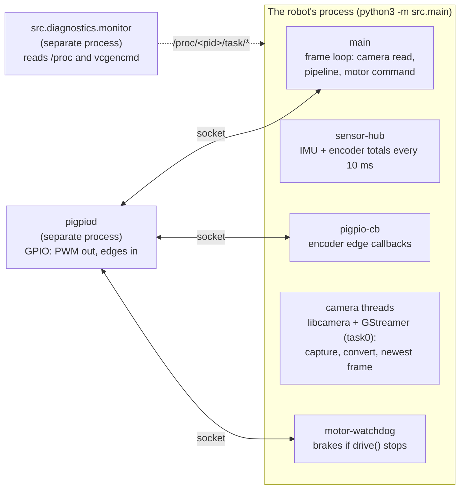

# Pi Diagnostics

> Record how a run uses the Pi: every thread's CPU and core, every core's load, the GIL's hand-offs as context switches, and temperature, clock, throttling and memory. Evidence for the OS side of the robot.

The Pi's operating system is part of the robot, and a risk to it:
- the kernel decides which core each thread runs on;
- Python's GIL decides which Python thread runs Python;
- heat or a weak supply throttles the clock;
- memory runs short on a 512 MB Pi Zero 2 W.

None of that shows in the pipeline's own logs. `src/diagnostics/` records it for any run (`main.py`, any linker, a test) without changing that run: the recorder is its own process, reads `/proc` and the Pi's sensors, and shares no GIL with the robot.

**Code:** `src/diagnostics/monitor.py` (the recorder), `threads.py` (threads, cores, thread names), `system_monitor.py` (temperature, clock, throttling, memory), `os_counters.py` (the rest of the Pi, section 8), `capture_anatomy.py` (the camera path, section 7), `frame_meta.py` (every frame's exposure and gains, section 9), `i2c_trace.py` (every I2C transfer, section 10) · **Tests:** `src/tests/test_monitor.py`, `test_threads.py`, `test_system_monitor.py`, `test_os_counters.py`, `test_capture_anatomy.py`, `test_frame_meta.py`, `test_i2c_trace.py`

---

## 1. Running it

From `vision_stack/`. Put the run you want to watch after `--`:

```
python3 -m src.diagnostics.monitor -- python3 -m src.navigation_linker --camera --no-motors --no-button --max-run-s 60
python3 -m src.diagnostics.monitor -- python3 -m src.main
python3 -m src.diagnostics.monitor -- python3 -m src.intersection_linker left --camera
```

The run behaves exactly as without the recorder: its output, start button and Ctrl-C all work. Ctrl-C reaches both; the recorder waits up to 15 s for the run to halt its motors and exit, then writes its files. The exit code is the run's.

To watch a run started elsewhere (another terminal, over SSH):

```
python3 -m src.diagnostics.monitor --match src.main        # waits up to 30 s for it to start
python3 -m src.diagnostics.monitor --pid 1234 --duration 60
```

| Option | Default | Meaning |
|---|---|---|
| `--interval S` | 0.5 | Thread and core sampling period. System readings are once a second |
| `--duration S` | until the run ends | Stop recording after S seconds |
| `--out DIR` | `runs/diag_<timestamp>` | Where the files go |

The recorder costs the robot almost nothing. It runs in a separate process. Per interval it reads two small files per thread plus `/proc/stat`. Once a second it runs `vcgencmd` and reads `/proc/interrupts`, `diskstats`, `meminfo`, `pressure` and every process's `stat`. Every 5 s it runs two more `vcgencmd` calls, for the clocks. Its own CPU shows in `procs.csv` as `monitor (self)`.

---

## 2. What runs in a course run



| Thread name (as recorded) | What it is | Expect |
|---|---|---|
| `main` | The frame loop. Perception, estimation and navigation all run here | The busiest thread |
| `sensor-hub` | `peripherals/sensing.py`: reads the IMU and encoder totals every 10 ms | A few % CPU, ~200 voluntary switches a second: per tick one sleep and one I²C transfer (the IMU's sample block), more when it waits for the GIL (measured 5.6% and 220 a second, 2026-10-03). Before the block read (2026-10-03) the Adafruit driver's 7 transfers per reading took 4.6 ms and showed as ~800 a second alone, ~2,900 and 54% CPU in a run |
| `pigpio-cb` | pigpio's callback thread, one per `pigpio.pi()` connection. `main.py` has three: the encoders' (counting edges), the motors' and the start button's (both idle). A linker opens only what its flags ask for: `--no-motors --no-button` leaves the encoders' alone | Low CPU; voluntary switches rise with wheel speed (one wake per batch of edges) |
| `task0` | GStreamer's streaming thread: libcamera's frames through `videoconvert` into OpenCV's newest-frame `appsink` (pure C, no GIL) | 25–35%, steady (2026-10-03, 480x270 at 20 FPS) |
| `CameraManager` ×3, `IPAProxyRPi` | libcamera itself: frame requests to the sensor, and the image algorithms (auto exposure, white balance) | `CameraManager` ~5%, ~200 voluntary switches a second; the rest near zero |
| `pool-spawner`, `pool-1`, `python3-ust` ×2 | Thread pools and LTTng tracing threads libcamera starts | Idle |
| `python3` (unnamed) | OpenCV's TBB worker: the Pi's OpenCV is built with TBB as its parallel framework (`cv2.getBuildInformation()`), which starts its workers at the first parallel operation (2026-10-03: 1 thread after `import cv2`, 4 after a blur). `src/perception/__init__.py` caps OpenCV at `OPENCV_THREADS` = 2, so one worker beside `main`; TBB starts it, not our code, so nothing names it | ~33%, few involuntary switches. At OpenCV's default of 4 there were three, ~20% each and ~1,300 involuntary switches a second each, spinning while they waited for work (`params.py` has the 4 / 2 / 1 comparison) |
| `frame-recorder` | Linkers only: writes frames to disk (`linker_io.FrameRecorder`) | Bursts while recording |
| `motor-watchdog` | `peripherals/drive.py`: brakes the motors if the loop stops commanding them (`production_run.md`, "If the loop gets stuck"). Only with real motors | Near zero; 10 wakes a second |
| `system-monitor` | Soak tests only (`SystemMonitor`) | Near zero |

The names come from `threads.name_os_thread()`. Each thread the code starts names itself in the kernel, and `drive.py` and `system.py` name pigpio's whenever they open a connection. Without that, `top`, `ps` and `/proc` show every Python thread as `python3`. Python's own thread names don't reach the OS before Python 3.14.

---

## 3. Reading the results

Everything goes to `runs/diag_<timestamp>/`. `summary.txt` first:

```
threads, busiest first (cpu % of one core; cores = share of samples on each)
  name                 tid  cpu mean    max  cores                        moves    vol/s invol/s
  main                1040      71.2   98.0  0:22% 1:31% 2:25% 3:22%         37    410.2    12.0
  ...
  total 104.0% of one core (26.0% of the Pi)

cores
  core 0  busy mean  45.1%  max  92.0%  (every process, not only this one)

system
  temperature max 61.2 C   clock 600-1000 MHz   memory: run max 182.0 MB, available min 210.5 MB
  throttled during the run: never
  latched since boot: under_voltage

os (the whole Pi)
  CMA free min 180 MB   clocks: ISP 300-300 MHz, core 400-400 MHz
  SD card: write mean 210 kB/s (max 1400), read max 0 kB/s, busy max 12%
  stalled (pressure, max of the 10 s averages): cpu 4.1%, io 0.3%, memory 0.0%

interrupts per second, busiest 8 (counted by the hardware; Unicam follows the frames)
  unicam                             (41)  mean     40.0  max     41.0
  ...
other processes, busiest 6 (cpu % of one core; the run itself is in threads above)
  pigpiod                  412  mean   6.2  max   7.9
  monitor (self)          1101  mean   3.0  max   4.1
```

| Column | Meaning |
|---|---|
| `cpu mean` / `max` | % of **one** core, averaged over each interval (user + system). 100 = one core flat out |
| `cores` | The share of samples the thread was last seen on each core: how the kernel spread it |
| `moves` | Samples on a different core than the one before. A floor on migrations, since only the last core is visible |
| `vol/s` | Voluntary context switches: the thread blocked. A sleep, a socket or I²C wait, **or waiting for the GIL** |
| `invol/s` | Involuntary: the kernel took the core away for something else. High values mean the cores are oversubscribed |
| `total` | Summed CPU of this process; "% of the Pi" divides by the core count |
| core `busy` | The whole core, every process: a busy core with a quiet robot means something else is running |
| `throttled during the run` | Flags active while recording: `under_voltage`, `freq_capped`, `throttled`, `soft_temp_limit` |
| `latched since boot` | The same flags, set at any time since boot (`vcgencmd get_throttled` bits 16–19) |

**What to look for:**

- **Throttling during the run.** `under_voltage` means the supply sags under motor load: fix the power path before tuning anything. `throttled` or `soft_temp_limit` means heat: the clock drops and every frame slows.
- **The clock range.** A minimum below the maximum during a run means the CPU was slowed, by heat or by the governor.
- **`main` near 100% of a core.** The frame loop is CPU-bound; the frame rate drops. Compare with the run's own `stage_timing` or `nav.csv` timings.
- **`invol/s` high on `main`.** Other threads or processes take its core. Check which cores are busy.
- **`sensor-hub` below ~100 `vol/s`, or with real CPU.** Its 10 ms ticks are slipping, or each IMU read is slow. Time one read: `python3 -c "import time; from src.peripherals.imu import IMUReader; r = IMUReader(); t = time.perf_counter(); [r.read() for _ in range(500)]; print((time.perf_counter() - t) / 0.5, 'ms')"`. At the Pi's default 100 kHz I²C clock the 14-byte block takes about 1.5 ms on the wire; `dtparam=i2c_arm_baudrate=400000` in `/boot/firmware/config.txt` (the MPU-6050 is rated for it; the camera's I²C is a separate bus) cuts that to about 0.4 ms.
- **Memory.** A rising run maximum over a long run is a leak. A low "available" minimum matters on a 512 MB Pi: the camera dropping out mid-run has looked like memory pressure before, so note the minimum on runs where it happens.

**GIL hand-offs.** Python forces the GIL holder to hand it over every 5 ms when another Python thread is waiting (`sys.getswitchinterval()`). Each hand-off is a voluntary switch for the waiter. So a Python thread that never sleeps but shows tens of voluntary switches a second is sharing the GIL. To see who holds the GIL directly, use `py-spy` (section 5).

**The CSVs** hold the same data over time, for plotting or for lining up with a run's own logs:

| File | One row per | Columns |
|---|---|---|
| `threads.csv` | thread per interval | `elapsed_s, tid, name, state, core, cpu_pct, user_pct, sys_pct, vol_ctx_s, invol_ctx_s` |
| `cores.csv` | core per interval | `elapsed_s, core, busy_pct` |
| `system.csv` | second | `elapsed_s, temp_c, cpu_mhz, throttled_raw`, each flag and `*_occurred`, `rss_mb, mem_available_mb, load_1m` |
| `meta.json` | run | The command, pid, interval, core count, kernel and Python versions, `monotonic_start_s` |

`elapsed_s` counts from the recorder's start. `monotonic_start_s` is that start on the system's monotonic clock, the clock the robot's timestamps use too.

---

## 4. For the design review

A repeatable set that shows how the Pi holds up:

1. **Bench, motors off:** `python3 -m src.diagnostics.monitor -- python3 -m src.navigation_linker --camera --no-motors --no-button --max-run-s 120`. CPU split and temperature without motor load.
2. **Motors on, wheels off the ground:** the same with the motors on. Under-voltage shows up here if the supply is marginal.
3. **The course:** `python3 -m src.diagnostics.monitor -- python3 -m src.main`. The real load, with nothing recorded by the robot itself.
4. **Long run:** the soak test (`testing_procedure.md`, tier 4) for heat and memory over 15 minutes, with `system.csv` from `SystemMonitor`.

Then interpret each recording over time with `python3 -m src.analysis.pi_load runs/diag_<time>`. Add `--run runs/nav_<time>` for a `navigation_linker` run, which lines the run's frames up with the recording and says what its slow frames coincided with (`analysis.md`, "Pi load").

Keep each run's `summary.txt`. The per-thread table, the core loads and the throttle lines are the evidence.

---

## 5. Companion tools

| Tool | Shows | Command |
|---|---|---|
| `top -H` | Live CPU per thread (named, now) | `top -H -p $(pgrep -f src.main)`; press `1` for per-core load |
| `ps -L` | Each thread's current core | `watch -n 0.5 ps -L -o tid,comm,psr,pcpu -p $(pgrep -f src.main)` |
| `py-spy` | Who holds the GIL, as a flame graph per thread | `pip install py-spy`, then `sudo py-spy record --pid $(pgrep -f src.main) --gil --threads -o gil.svg -d 20` |

`py-spy` is the one thing the recorder can't do, since the GIL lives inside the robot's process. Run it alongside the recorder for a full picture.

---

## 6. Limits

- **One sample's core is only where the thread last ran.** A thread can visit several cores within one interval; `moves` is a floor.
- **`cpu %` is an average over the interval.** A 50 ms spike inside a 0.5 s interval shows as 10%. Shorten `--interval` (0.1 is fine) to see bursts.
- **Voluntary switches mix causes.** Sleeps, I/O and GIL waits all count. `py-spy --gil` separates out the GIL.
- **Throttle flags need `vcgencmd`** (a Pi). Elsewhere the system lines say so, and the thread and core data still record.

---

## 7. Capture anatomy: the camera path

`make capture-anatomy` (or `python3 -m src.diagnostics.capture_anatomy [--seconds 10] [--camera-control KEY=VALUE]`) records once how a frame gets from the sensor to OpenCV on this Pi. Stop the robot's pipeline first: the camera opens in one process at a time.

```
IMX290 --CSI-2--> Unicam --DMA--> raw Bayer in CMA memory --> VideoCore ISP --> YUV 480x270
(1920x1080 10-bit)  (/dev/video0)                            (demosaic, colour, scale)
                                         libcamera IPA (AGC/AWB, on the ARM cores) <-- ISP statistics
                                         --> next exposure and gain, over I2C to the sensor
YUV --> videoconvert --> videoflip --> BGR --> appsink --> OpenCV        (ARM cores, software)
```

It runs the robot's exact pipeline string, appsink swapped for a silent fakesink, under `gst-launch-1.0 -v` with GStreamer's latency tracer and libcamera's log on, and probes the rest:

| File | From | Shows |
|---|---|---|
| `summary.txt` | all of it | the route, the caps, ms per element, the VideoCore side, findings |
| `media<N>.txt`, `.dot`, `.png` | `media-ctl -p`, `--print-dot` | the kernel's hardware graph: sensor -> Unicam, the ISP's input and output nodes, the format on each link |
| `gst_launch.txt`, `gst_pipeline.dot/.png` | `gst-launch-1.0 -v`, `GST_DEBUG_DUMP_DOT_DIR` | the caps every pad settled on: what the ISP hands over decides what videoconvert does |
| `gst_trace.log`, `latency.csv` | `GST_TRACERS=latency(flags=pipeline+element)` | per frame: how long each element held it, and source pad to sink |
| `libcamera.log` | `LIBCAMERA_LOG_LEVELS=*:INFO` | the sensor mode and Unicam format libcamera picked, the streams it configured |
| `vc_*.txt` | `vcgencmd` | ARM, core, ISP, 3D and H.264 clocks; core volts; the ARM / GPU memory split |
| `anatomy.json` | | everything parsed |

Also kept: `uname.txt`, `v4l2_devices.txt`, `cameras.txt` (`rpicam-hello --list-cameras`), `gst_libcamerasrc.txt` (every control the camera takes). Graphviz (`sudo apt install graphviz`) draws the `.dot` files; without it they stay text. `media-ctl` and `v4l2-ctl` come with `v4l-utils`. A missing tool is listed under "not available here" and the rest still records.

Findings it reports:
- **videoconvert + videoflip over 2 ms a frame.** That is software work on the ARM cores. The ISP can output BGR, and the IMX290 can flip in hardware, which would make both copies go away.
- **Fewer fps than asked for.**
- **The CMA pool under 10% free.** Camera buffers are allocated from it.
- **No frame at all.** Usually the camera is open in another process.

Limits: the ISP's own time happens inside `libcamerasrc`, before its first pad, so GStreamer can't see it. The per-frame sensor timestamps (section 9) can. The tracer adds a little time to every element it measures, so treat the figures as an upper bound.

---

## 8. The rest of the Pi: interrupts, other processes, SD card, pressure

Around the robot's own threads, the kernel and the other processes keep working, and some of that is the robot's work done elsewhere:
- the camera's frames arrive as **Unicam** interrupts and go to the ISP over **VCHIQ**;
- the IMU and the ADS1115 answer over **I2C**;
- **pigpiod** times the motor PWM by DMA in its own process;
- a recording writes to the **SD card**.

The recorder (section 1) reads all of this once a second from `/proc` and `vcgencmd` (`src/diagnostics/os_counters.py`), with no extra command:

| Where | Column / file | What it is |
|---|---|---|
| `irqs.csv` | `irq`, `name`, `rate_hz` | Interrupts per second per `/proc/interrupts` line, summed over the cores, for each second the line fired. Unicam should sit near the frame rate (once or twice per frame); VCHIQ follows the ISP traffic; `mmc` the SD card |
| `procs.csv` | `pid`, `name`, `cpu_pct` | Every other process's CPU (% of one core) for each second it ran. The robot's process is left out (its threads are in `threads.csv`); the recorder shows as `monitor (self)` |
| `system.csv` | `cma_free_mb` | The contiguous memory pool camera buffers come from |
| | `isp_mhz`, `core_mhz` | VideoCore clocks, every 5 s (blank between) |
| | `disk_read_kbps`, `disk_write_kbps`, `disk_busy_pct` | The SD card (`mmcblk0`), from `/proc/diskstats` |
| | `psi_cpu_some`, `psi_io_some`, `psi_memory_some` | Pressure stall information: % of the last 10 s that some task waited for CPU, I/O or memory. Blank when the kernel doesn't have PSI (Raspberry Pi OS needs `psi=1` in `cmdline.txt`) |
| | `os_dt_s` | Seconds since the last reading; blank on the first, which has no rates |

The summary's `os`, `interrupts` and `other processes` sections are these, averaged over every second of the recording (a second a line didn't fire counts as 0). `make pi-load` reports them over the run's own window and flags:
- a process using 15% of a core or more;
- the SD card busy half of any second;
- a task stalled 10% of the time.

What to look for:
- **Unicam well under the frame rate:** frames are lost before GStreamer, at the sensor or receiver.
- **A climbing `mmc` rate with slow frames:** a recording's writes.
- **pigpiod's share:** the price of DMA-timed PWM. Its `-s` sample rate sets it.
- **CMA falling over a soak:** buffers leaking.

---

## 9. Frame metadata: what auto exposure did to every frame

`make frame-meta` (or `python3 -m src.diagnostics.frame_meta [--seconds 20] [--camera-control KEY=VALUE] [--save-every N] [--no-detect]`) opens the camera through Picamera2. It sets it up like the robot's capture:
- the 1920x1080 sensor mode;
- 480x270 output at 20 fps;
- the 180° flip;
- `CAMERA_CONTROLS`, plus any `--camera-control`.

For every frame, it logs the metadata libcamera reports next to what the color branch (MEASURED) reads in the traffic ROI. The robot's GStreamer pipeline drops that metadata at the appsink, which is why this is a separate recorder. Stop the robot's pipeline first.

Picamera2 ships with Raspberry Pi OS (`sudo apt install python3-picamera2`). A venv sees it only if it was made with `--system-site-packages`. Without Picamera2, `rpicam-hello -n -t 10000 --metadata meta.json` records the same metadata, without the detection.

| Column (`frames.csv`) | From | Meaning |
|---|---|---|
| `exposure_us`, `analogue_gain`, `digital_gain` | AGC (libcamera's IPA, on the ARM cores) | How long and how amplified the frame was. Exposure × gain is the light gathered |
| `colour_gain_r`, `colour_gain_b`, `colour_temp_k` | AWB | The white balance applied |
| `lux`, `frame_duration_us`, `ae_locked` | IPA | Scene brightness estimate, the frame's length, whether AE had settled |
| `sensor_to_python_ms` | `SensorTimestamp` vs `time.monotonic_ns()` | From the sensor starting to expose the frame to Python having it: readout, ISP, IPA and queue. Both are on the monotonic clock; a value outside 0-1000 ms is dropped as a clock mismatch |
| `label`, `confidence`, `white_px` | the color branch on the traffic ROI | What the robot would have read |

`summary.txt` gives each field's min / median / max, and per label the median light, exposure, gain and white pixels. Findings:
- **AGC swung the light gathered more than 2×.** The lamps look different as it moves.
- **Red and yellow frames both seen.** If yellow frames got 1.2× the light of red ones or more, overexposure is turning the red ring orange: try `--camera-control exposure-value=-1`. If not, the angle is.
- **Frames reach Python later than one frame time (50 ms).**
- **AE settled on under half the frames.**
- **Fewer fps than asked for.** An exposure longer than a frame stretches the frame.

To chase red-reads-yellow:
1. Hold the light on red.
2. Record while moving the robot through the angles where it misreads.
3. Read the per-label lines.
4. Repeat with `--camera-control exposure-value=-1` and compare.

`--save-every 5` keeps every fifth frame in `frames/`, a folder `phase2_linker --frames` and `calib-lamps` read.

---

## 10. I2C trace: the bus, transfer by transfer

Two devices share **i2c-1** (GPIO 2/3):
- the MPU-6050 at 0x68, read by the `sensor-hub` thread 100 times a second (one 14-byte block per read);
- the ADS1115 at 0x48, read by the battery monitor's thread once a second.

The camera has its own bus (i2c-10 or i2c-0), on which libcamera writes the exposure and gain AGC picked into the IMX290 every frame.

The kernel traces every I2C transfer on every bus, from any process (the `i2c` tracepoints). `make i2c-trace` turns those on for 10 s and reads them back. It changes nothing in the robot, so start the run first in another terminal:

```
make nav-dry                         # terminal 1 (or any run)
make i2c-trace                       # terminal 2: sudo, 10 s
make i2c-trace ARGS="--seconds 30"
python3 -m src.diagnostics.i2c_trace --from runs/i2c_<time>      # re-analyze anywhere, no root (draws the figure)
```

While tracing, it:
- enlarges the trace buffer;
- sets the trace clock to `mono`, so the times line up with the runs' `t0_monotonic`;
- clears the buffer.

Afterwards it puts every setting back, even after Ctrl-C. The folder (`runs/i2c_<time>/`, handed back to your user) holds:

| File | What |
|---|---|
| `summary.txt` | per bus, per device, findings |
| `transactions.csv` | one row per transfer: start (monotonic s), bus, address, device, the thread that asked, the messages (`w1 r14` = write 1 byte, read 14), bytes, wire time, how long it held the bus, the result, the first bytes written / read |
| `i2c_trace.json` | everything computed, and each bus's clock |
| `trace.txt` | the kernel's trace as recorded |
| `i2c_trace.png` | a 200 ms window of transfers on a lane per device, each bus's occupancy per second, the IMU's read spacing (needs matplotlib, so on a laptop with `--from`) |

What the numbers mean:
- **Occupancy:** the share of time a transfer was in progress on the bus.
- **Wire:** the share the bits alone need at the bus clock. Each message is a start, the address byte and each data byte at 9 bits with the ACK, plus one stop. The clock comes from the device tree, or is assumed to be 100 kHz, which the summary says.
- **Overhead:** occupancy ÷ wire: the driver, interrupts and the controller's FIFO.

Expected numbers:
- **The IMU's read:** 156 bits, 1.56 ms at 100 kHz, so 16% of the bus at 100 Hz. At 400 kHz, 0.39 ms and 4%.
- **The IMU's gaps:** a steady 10 ms, the sensor hub's period. Longer gaps are its ticks slipping (the GIL, or a slow read).
- **Queued:** a device's transfers that started within 100 µs of another device's ending. The kernel serializes transfers on a bus, so those waited for it.

Findings:
- a bus busy 50% of the time;
- transfers holding the bus 2× their wire time;
- failed transfers, named by error (`EREMOTEIO` is a missing ACK: wiring, address, or the device busy);
- IMU gaps over 15 ms at p95;
- IMU reads queued behind another device;
- i2c-1 at 100 kHz with its bits alone over 10%. `dtparam=i2c_arm_baudrate=400000` in `/boot/firmware/config.txt` cuts that 4×; both devices are rated for it;
- a trace buffer that overflowed.

Tracing needs root and a tracefs with the `i2c` events, which Raspberry Pi OS has. Without root it says so and records nothing.

