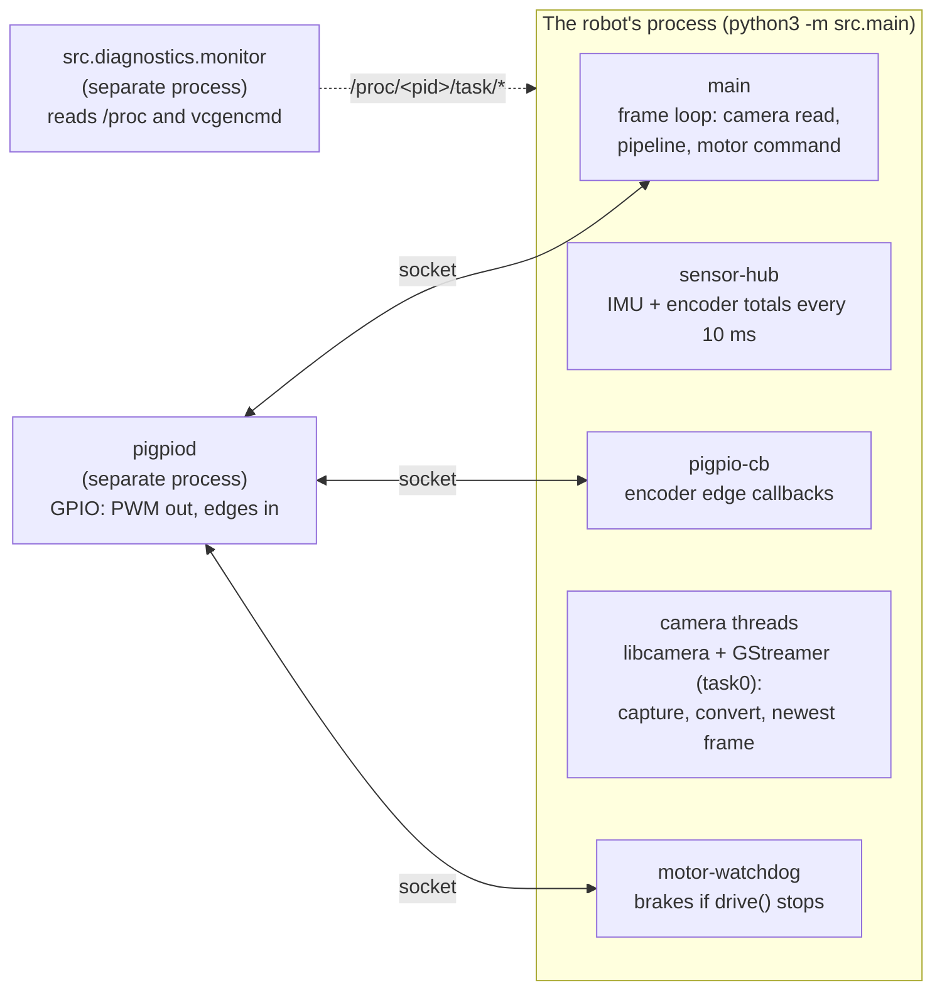

# Pi Diagnostics

> Record how a run uses the Pi: every thread's CPU and core, every core's load, the GIL's hand-offs as context switches, and temperature, clock, throttling and memory. Evidence for the OS side of the robot.

The Pi's operating system is part of the robot, and a risk to it:
- the kernel decides which core each thread runs on;
- Python's GIL decides which Python thread runs Python;
- heat or a weak supply throttles the clock;
- memory runs short on a 512 MB Pi Zero 2 W.

None of that shows in the pipeline's own logs. `src/diagnostics/` records it for any run (`main.py`, any linker, a test) without changing that run: the recorder is its own process, reads `/proc` and the Pi's sensors, and shares no GIL with the robot.

**Code:** `src/diagnostics/monitor.py` (the recorder), `threads.py` (threads, cores, thread names), `system_monitor.py` (temperature, clock, throttling, memory) · **Tests:** `src/tests/test_monitor.py`, `test_threads.py`, `test_system_monitor.py`

---

## 1. Running it

From `vision_stack/`. Put the run you want to watch after `--`:

```
python3 -m src.diagnostics.monitor -- python3 -m src.navigation_linker --camera --no-motors --no-button --max-run-s 60
python3 -m src.diagnostics.monitor -- python3 -m src.main
python3 -m src.diagnostics.monitor -- python3 -m src.intersection_linker left --camera
```

The run behaves exactly as without the recorder: its output, start button and Ctrl-C all work. Ctrl-C reaches both; the recorder waits up to 15 s for the run to halt its motors and exit, then writes its files. The exit code is the run's.

To watch a run started elsewhere (another terminal, over SSH):

```
python3 -m src.diagnostics.monitor --match src.main        # waits up to 30 s for it to start
python3 -m src.diagnostics.monitor --pid 1234 --duration 60
```

| Option | Default | Meaning |
|---|---|---|
| `--interval S` | 0.5 | Thread and core sampling period. System readings are once a second |
| `--duration S` | until the run ends | Stop recording after S seconds |
| `--out DIR` | `runs/diag_<timestamp>` | Where the files go |

The recorder costs the robot almost nothing: per interval, it reads two small files per thread plus `/proc/stat`, and runs `vcgencmd` once a second, all in a separate process.

---

## 2. What runs in a course run



| Thread name (as recorded) | What it is | Expect |
|---|---|---|
| `main` | The frame loop. Perception, estimation and navigation all run here | The busiest thread |
| `sensor-hub` | `peripherals/sensing.py`: reads the IMU and encoder totals every 10 ms | A few % CPU, ~200 voluntary switches a second: per tick one sleep and one I²C transfer (the IMU's sample block), more when it waits for the GIL (measured 5.6% and 220 a second, 2026-10-03). Before the block read (2026-10-03) the Adafruit driver's 7 transfers per reading took 4.6 ms and showed as ~800 a second alone, ~2,900 and 54% CPU in a run |
| `pigpio-cb` | pigpio's callback thread, one per `pigpio.pi()` connection. `main.py` has three: the encoders' (counting edges), the motors' and the start button's (both idle). A linker opens only what its flags ask for: `--no-motors --no-button` leaves the encoders' alone | Low CPU; voluntary switches rise with wheel speed (one wake per batch of edges) |
| `task0` | GStreamer's streaming thread: libcamera's frames through `videoconvert` into OpenCV's newest-frame `appsink` (pure C, no GIL) | 25–35%, steady (2026-10-03, 480x270 at 20 FPS) |
| `CameraManager` ×3, `IPAProxyRPi` | libcamera itself: frame requests to the sensor, and the image algorithms (auto exposure, white balance) | `CameraManager` ~5%, ~200 voluntary switches a second; the rest near zero |
| `pool-spawner`, `pool-1`, `python3-ust` ×2 | Thread pools and LTTng tracing threads libcamera starts | Idle |
| `python3` (unnamed) | OpenCV's TBB worker: the Pi's OpenCV is built with TBB as its parallel framework (`cv2.getBuildInformation()`), which starts its workers at the first parallel operation (2026-10-03: 1 thread after `import cv2`, 4 after a blur). `src/perception/__init__.py` caps OpenCV at `OPENCV_THREADS` = 2, so one worker beside `main`; TBB starts it, not our code, so nothing names it | ~33%, few involuntary switches. At OpenCV's default of 4 there were three, ~20% each and ~1,300 involuntary switches a second each, spinning while they waited for work (`params.py` has the 4 / 2 / 1 comparison) |
| `frame-recorder` | Linkers only: writes frames to disk (`linker_io.FrameRecorder`) | Bursts while recording |
| `motor-watchdog` | `peripherals/drive.py`: brakes the motors if the loop stops commanding them (`production_run.md`, "If the loop gets stuck"). Only with real motors | Near zero; 10 wakes a second |
| `system-monitor` | Soak tests only (`SystemMonitor`) | Near zero |

The names come from `threads.name_os_thread()`. Each thread the code starts names itself in the kernel, and `drive.py` and `system.py` name pigpio's whenever they open a connection. Without that, `top`, `ps` and `/proc` show every Python thread as `python3`. Python's own thread names don't reach the OS before Python 3.14.

---

## 3. Reading the results

Everything goes to `runs/diag_<timestamp>/`. `summary.txt` first:

```
threads, busiest first (cpu % of one core; cores = share of samples on each)
  name                 tid  cpu mean    max  cores                        moves    vol/s invol/s
  main                1040      71.2   98.0  0:22% 1:31% 2:25% 3:22%         37    410.2    12.0
  ...
  total 104.0% of one core (26.0% of the Pi)

cores
  core 0  busy mean  45.1%  max  92.0%  (every process, not only this one)

system
  temperature max 61.2 C   clock 600-1000 MHz   memory: run max 182.0 MB, available min 210.5 MB
  throttled during the run: never
  latched since boot: under_voltage
```

| Column | Meaning |
|---|---|
| `cpu mean` / `max` | % of **one** core, averaged over each interval (user + system). 100 = one core flat out |
| `cores` | The share of samples the thread was last seen on each core: how the kernel spread it |
| `moves` | Samples on a different core than the one before. A floor on migrations, since only the last core is visible |
| `vol/s` | Voluntary context switches: the thread blocked. A sleep, a socket or I²C wait, **or waiting for the GIL** |
| `invol/s` | Involuntary: the kernel took the core away for something else. High values mean the cores are oversubscribed |
| `total` | Summed CPU of this process; "% of the Pi" divides by the core count |
| core `busy` | The whole core, every process: a busy core with a quiet robot means something else is running |
| `throttled during the run` | Flags active while recording: `under_voltage`, `freq_capped`, `throttled`, `soft_temp_limit` |
| `latched since boot` | The same flags, set at any time since boot (`vcgencmd get_throttled` bits 16–19) |

**What to look for:**

- **Throttling during the run.** `under_voltage` means the supply sags under motor load: fix the power path before tuning anything. `throttled` or `soft_temp_limit` means heat: the clock drops and every frame slows.
- **The clock range.** A minimum below the maximum during a run means the CPU was slowed, by heat or by the governor.
- **`main` near 100% of a core.** The frame loop is CPU-bound; the frame rate drops. Compare with the run's own `stage_timing` or `nav.csv` timings.
- **`invol/s` high on `main`.** Other threads or processes take its core. Check which cores are busy.
- **`sensor-hub` below ~100 `vol/s`, or with real CPU.** Its 10 ms ticks are slipping, or each IMU read is slow. Time one read: `python3 -c "import time; from src.peripherals.imu import IMUReader; r = IMUReader(); t = time.perf_counter(); [r.read() for _ in range(500)]; print((time.perf_counter() - t) / 0.5, 'ms')"`. At the Pi's default 100 kHz I²C clock the 14-byte block takes about 1.5 ms on the wire; `dtparam=i2c_arm_baudrate=400000` in `/boot/firmware/config.txt` (the MPU-6050 is rated for it; the camera's I²C is a separate bus) cuts that to about 0.4 ms.
- **Memory.** A rising run maximum over a long run is a leak. A low "available" minimum matters on a 512 MB Pi: the camera dropping out mid-run has looked like memory pressure before, so note the minimum on runs where it happens.

**GIL hand-offs.** Python forces the GIL holder to hand it over every 5 ms when another Python thread is waiting (`sys.getswitchinterval()`). Each hand-off is a voluntary switch for the waiter. So a Python thread that never sleeps but shows tens of voluntary switches a second is sharing the GIL. To see who holds the GIL directly, use `py-spy` (section 5).

**The CSVs** hold the same data over time, for plotting or for lining up with a run's own logs:

| File | One row per | Columns |
|---|---|---|
| `threads.csv` | thread per interval | `elapsed_s, tid, name, state, core, cpu_pct, user_pct, sys_pct, vol_ctx_s, invol_ctx_s` |
| `cores.csv` | core per interval | `elapsed_s, core, busy_pct` |
| `system.csv` | second | `elapsed_s, temp_c, cpu_mhz, throttled_raw`, each flag and `*_occurred`, `rss_mb, mem_available_mb, load_1m` |
| `meta.json` | run | The command, pid, interval, core count, kernel and Python versions, `monotonic_start_s` |

`elapsed_s` counts from the recorder's start. `monotonic_start_s` is that start on the system's monotonic clock, the clock the robot's timestamps use too.

---

## 4. For the design review

A repeatable set that shows how the Pi holds up:

1. **Bench, motors off:** `python3 -m src.diagnostics.monitor -- python3 -m src.navigation_linker --camera --no-motors --no-button --max-run-s 120`. CPU split and temperature without motor load.
2. **Motors on, wheels off the ground:** the same with the motors on. Under-voltage shows up here if the supply is marginal.
3. **The course:** `python3 -m src.diagnostics.monitor -- python3 -m src.main`. The real load, with nothing recorded by the robot itself.
4. **Long run:** the soak test (`testing_procedure.md`, tier 4) for heat and memory over 15 minutes, with `system.csv` from `SystemMonitor`.

Then interpret each recording over time with `python3 -m src.analysis.pi_load runs/diag_<time>`. Add `--run runs/nav_<time>` for a `navigation_linker` run, which lines the run's frames up with the recording and says what its slow frames coincided with (`analysis.md`, "Pi load").

Keep each run's `summary.txt`. The per-thread table, the core loads and the throttle lines are the evidence.

---

## 5. Companion tools

| Tool | Shows | Command |
|---|---|---|
| `top -H` | Live CPU per thread (named, now) | `top -H -p $(pgrep -f src.main)`; press `1` for per-core load |
| `ps -L` | Each thread's current core | `watch -n 0.5 ps -L -o tid,comm,psr,pcpu -p $(pgrep -f src.main)` |
| `py-spy` | Who holds the GIL, as a flame graph per thread | `pip install py-spy`, then `sudo py-spy record --pid $(pgrep -f src.main) --gil --threads -o gil.svg -d 20` |

`py-spy` is the one thing the recorder can't do, since the GIL lives inside the robot's process. Run it alongside the recorder for a full picture.

---

## 6. Limits

- **One sample's core is only where the thread last ran.** A thread can visit several cores within one interval; `moves` is a floor.
- **`cpu %` is an average over the interval.** A 50 ms spike inside a 0.5 s interval shows as 10%. Shorten `--interval` (0.1 is fine) to see bursts.
- **Voluntary switches mix causes.** Sleeps, I/O and GIL waits all count. `py-spy --gil` separates out the GIL.
- **Throttle flags need `vcgencmd`** (a Pi). Elsewhere the system lines say so, and the thread and core data still record.
