# Linker Code Maps

> Each linker's code drawn as diagrams, with the line numbers behind every box: who builds what, and what one frame does.

The linkers are written against **roles**, not hardware. `run()` takes a `source`, `sensors`, a `motor` and a `navigator` and only calls methods on them; `cli()` decides what fills each role (the camera or a replay, the real motors or `NoMotors`). Reading a linker is easier once you split it the same way:

1. **`cli()`, the construction space.** Parse the flags, open the hardware (`linker_io.open_rig()`), build the tuning, call `run()`.
2. **`run()`, the loop space.** Setup, then one iteration per frame, then `finally` (motors stop first), then the report and video.
3. **The chain, one layer down.** `run_chain()` (Phase 2), `processor.process()` (Phase 3), `navigator.update()` (Navigation), `SensorHub` (sensors).

Line numbers are as of 2026-10-02 (`main` after PR #21). If they drift, search for the quoted code.

**Contents**

- [The roles every linker uses](#the-roles-every-linker-uses)
- [The shared loop shape](#the-shared-loop-shape)
- [How the sensors reach a frame](#how-the-sensors-reach-a-frame)
- [phase2_linker](#phase2_linker)
- [phase3_linker](#phase3_linker)
- [maneuver_linker](#maneuver_linker)
- [navigation_linker](#navigation_linker)
- [intersection_linker](#intersection_linker)
- [Side by side](#side-by-side)

---

## The roles every linker uses

| Role | Must provide | Robot (`--camera`) | Replay (`--video` / `--frames`) | Tests |
| --- | --- | --- | --- | --- |
| `source` | `.read()` → `(frame, frame_id, timestamp_ms)`, `(None, None, None)` on a dropped frame, `None` at the end; `.close()`; `.fps` | `live_view.CameraFrameSource` over `capture.camera.CameraSource` | `VideoFrameSource` / `DirectoryFrameSource` | a class over synthetic scenes |
| `sensors` | `.read()` → `(SensorSample, SensorBatch)`; `.sample()`; `.stop()` | `sensing.Sensors(imu=True, encoders=True)` | `None` | a fake returning set samples |
| `motor` | `.drive(left, right)`, `.brake()`, `.stop()` | `drive.MotorController(pigpio.pi())` | `linker_io.NoMotors` | a fake that logs calls |
| `navigator` | `.update(packet)` → `Command`, `.reset()`; optional `.record`, `.finished`, `.outcome` | `navigation.Navigation(gyro_bias_dps, route)` | same | same |
| `system` | `wait_for_start()`, `run_countdown()`, `update_display()`, `show_final_time()`, `cleanup()` | `peripherals.system.System` (button, TM1637) | `None` | `None` or a fake |
| `clock` | returns seconds | `time.perf_counter` | same | `FakeClock` |

`linker_io.open_rig()` (`src/linker_io.py`) fills `source`, `sensors`, `motor` and `system` for the three driving linkers.

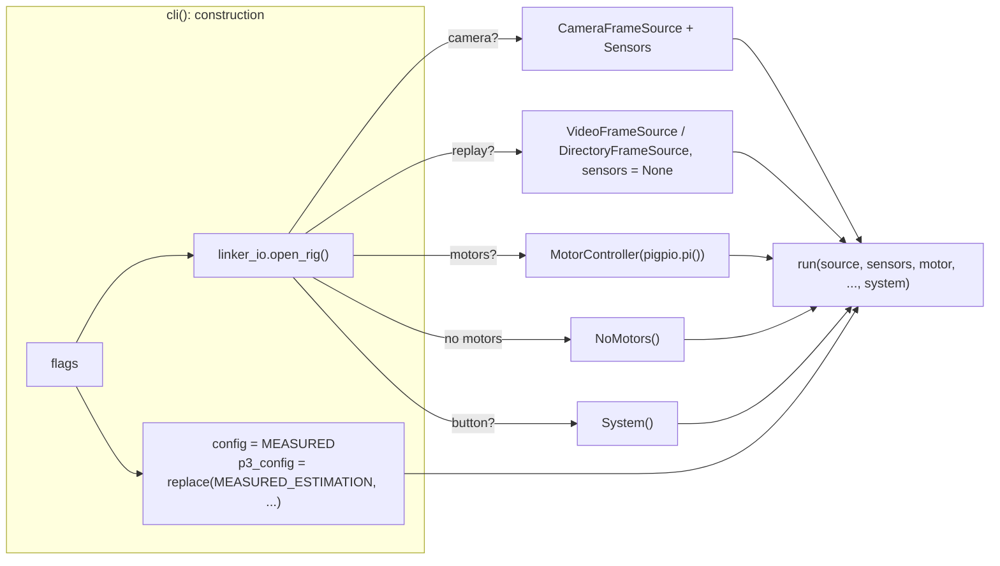

---

## The shared loop shape

`phase3_linker`, `maneuver_linker` and `navigation_linker` all have this shape. `phase2_linker`'s loop lives in `live_view.run()` with the same structure, and `intersection_linker` reuses `navigation_linker`'s.

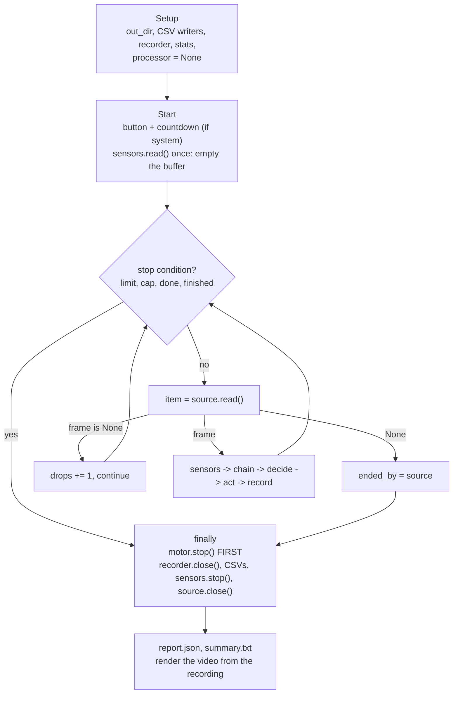

`try / except KeyboardInterrupt / except Exception / finally` wraps the loop, so Ctrl-C or a crash still stops the motors and leaves complete CSVs.

---

## How the sensors reach a frame

Every linker that drives calls `sensors.read()` or `sensors.sample()` once per frame. That one call sits on top of a background thread (`src/peripherals/sensing.py`):

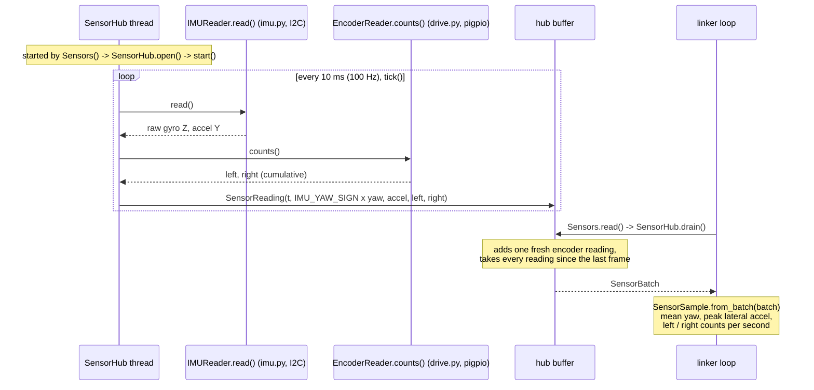

`Sensors.read()` returns `(sample, batch)`. Most linkers keep only `sample` (`read()[0]` or `sample()`). `maneuver_linker` also uses `batch`, for its cumulative counts.

---

## phase2_linker

**Purpose:** Phases 1–2 with overlays and per-stage video; no Phase 3, no sensors, no motors. Its loop is `live_view.run()`. `phase2_linker` only supplies *what to do with each frame* (`process`), so `live_view` never imports the pipeline.

### Who calls what

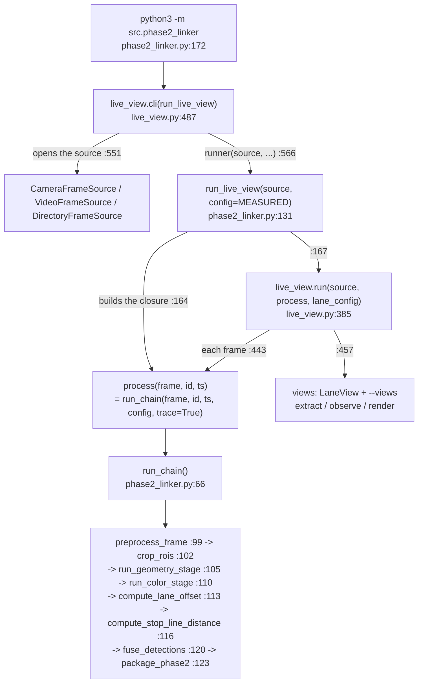

### One frame

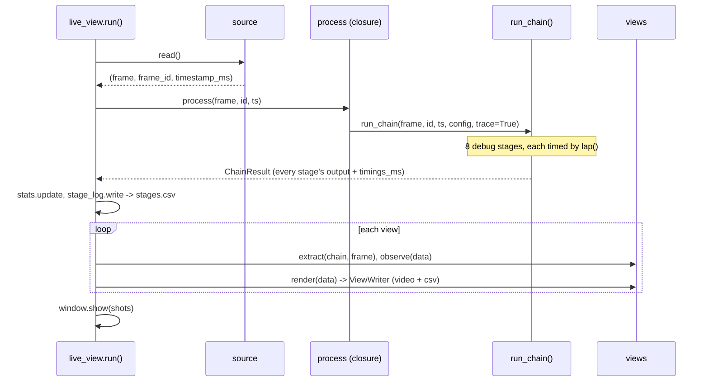

| Variable | What it is |
| --- | --- |
| `process` | A closure: `config` and `trace` baked in, so `live_view.run()` only passes `(frame, id, ts)` |
| `chain` | `ChainResult`: `.pre`, `.roi`, `.geometry`, `.offset`, `.stop_line`, `.fusion`, `.phase2`, plus each stage's debug dict and `timings_ms` |
| `views` | `debug_lane.LaneView` always, plus `--views stop,traffic,stopline,...`: each turns a `ChainResult` into a picture and a CSV row |

---

## phase3_linker

**Purpose:** Phases 1–3 with optional sensors (`--imu`, `--encoders`); records `p3.csv` and the Phase 3 video. No motors.

### Who calls what

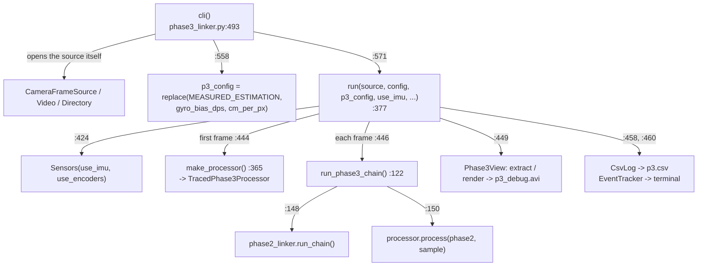

### One frame

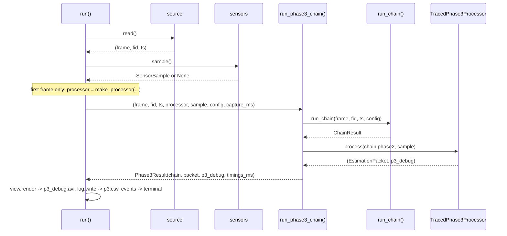

| Variable | What it is |
| --- | --- |
| `processor` | `TracedPhase3Processor`, built on the first frame (the cm scale needs the lane ROI width from the frame size). Kept for the run: it holds the EMA, votes and hold counters |
| `res` | `Phase3Result`: `.chain` (Phase 2), `.packet` (`EstimationPacket`), `.p3_debug` (Phase 3's log), `.timings_ms` |
| `events` | `EventTracker`: prints only *changes* (lane status, drive state, stop sign, stop line) |
| `stats` | `Phase3Stats`: timing and counts for `summary.txt` |

---

## maneuver_linker

**Purpose:** a scripted drive trial (settle, yaw-sign spins, a straight leg, a 180° turn, back). `maneuver.Maneuver` decides every command from the **sensors only**; vision runs every frame but only records. **The motors get their command before vision runs**, so the control loop never waits on the camera chain.

### Who calls what

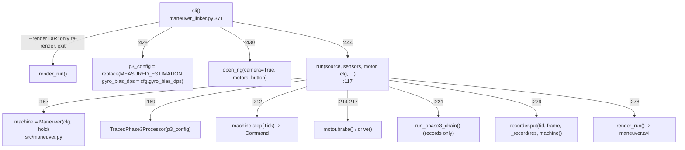

### One frame

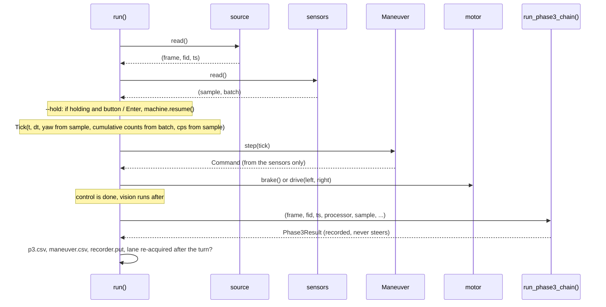

| Variable | What it is |
| --- | --- |
| `machine` | `Maneuver`: the trial's state machine (SETTLE, PULSE_LEFT / RIGHT, FORWARD, TURN, ...). `.step(tick)` → `Command`; `.record` is this frame's row; `.done` ends the loop |
| `tick` | `Tick` (`maneuver.py:91`): one frame's sensors in the trial's terms; `left_count` / `right_count` come from `batch` (cumulative), cps and yaw from `sample` |
| `resume` | `Resume`: `--hold`'s "continue" (button or Enter), polled without blocking |
| `reacquire` | When the lane came back (two boundaries on vision) after the turn, for the report |

---

## navigation_linker

**Purpose:** the course run (`main.py`) with a flight recorder: the whole chain decides and drives, and every frame is recorded.

### Who calls what

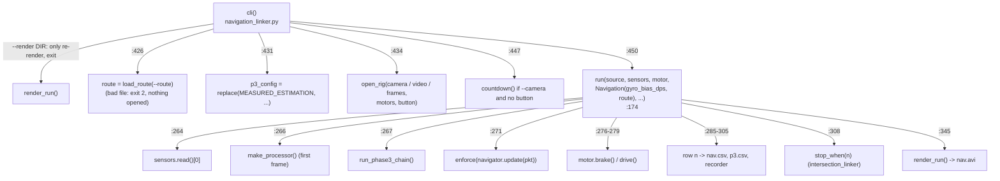

### One frame

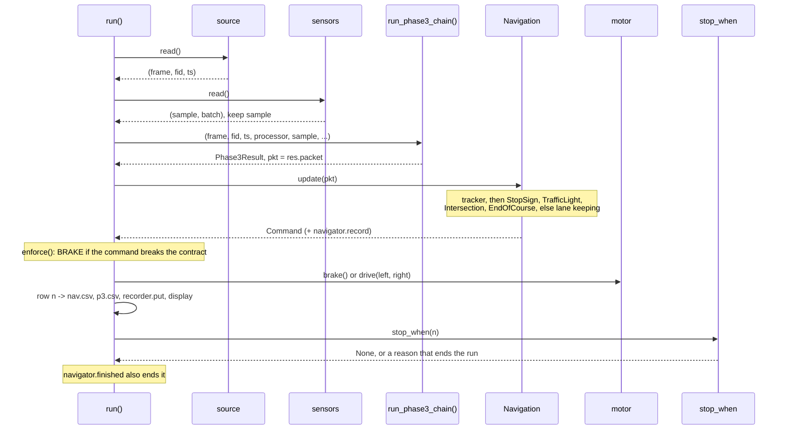

| Variable | What it is |
| --- | --- |
| `processor` | As in `phase3_linker`: `TracedPhase3Processor`, built on frame 1 |
| `res`, `pkt` | `Phase3Result`, and its `EstimationPacket` |
| `cmd`, `problems` | `enforce()`'s result: the command to drive, and why it was braked if it broke the contract |
| `rec` | `navigator.record`: which rule decided and its details (stage, heading, turn_end, step) |
| `n` | One `nav.csv` row: timings + `rec` + packet fields + the command |
| `event` | Printed only when the reason changes (`-> crossing`, `-> turning`) |
| `stop_when` | A hook: called with `n` after the motors have the command; a string ends the run with that reason |

---

## intersection_linker

**Purpose:** `navigation_linker.run()` with a one-intersection route and a watcher that ends the run once the lane is held after the crossing, then judges PASS or CHECK. It has no loop of its own: it reuses `navigation_linker`'s.

### Who calls what

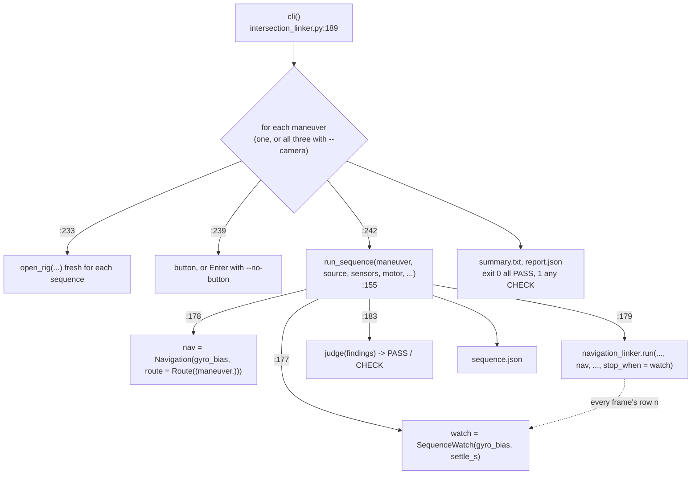

### What SequenceWatch does with each row

`SequenceWatch.__call__(n)` (`intersection_linker.py:84`) is the `stop_when` hook. It never touches the robot; it only reads `nav.csv` rows as they're written.

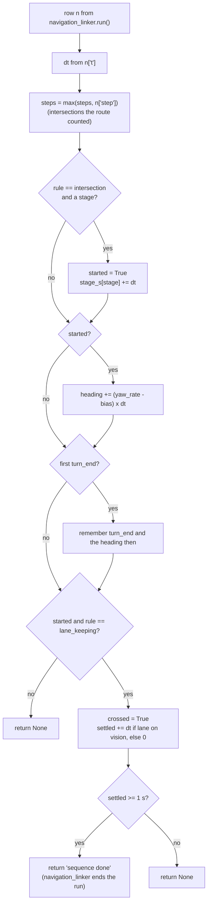

`judge()` (`:116`) then checks the findings: exactly 1 intersection, a turn that ended on the gyro target, ended by "sequence done", heading within 20° of −90 / +90 / 0, no contract breaks.

---

## Side by side

| | phase2_linker | phase3_linker | maneuver_linker | navigation_linker | intersection_linker |
| --- | --- | --- | --- | --- | --- |
| Loop lives in | `live_view.run()` | `run()` | `run()` | `run()` | `navigation_linker.run()` |
| Opens hardware with | `live_view.cli()` | its own `cli()` | `open_rig()` | `open_rig()` | `open_rig()` per sequence |
| Sensors | none | `Sensors(--imu, --encoders)` | `Sensors(imu, encoders)` | `Sensors(imu, encoders)` with `--camera` | same |
| Decides commands | nothing | nothing | `Maneuver.step(Tick)` (sensors only) | `Navigation.update(packet)` | `Navigation` with a one-step route |
| Vision's role | the subject | the subject | recorded only | drives | drives |
| Ends on | source end, `q`, limit | source end, limit | `machine.done`, abort | cap, source end, `navigator.finished`, `stop_when` | `SequenceWatch` ("sequence done"), cap |
| Writes | stages.csv, per-view videos | p3.csv, p3_debug.avi | maneuver.csv, p3.csv, maneuver.avi | nav.csv, p3.csv, nav.avi | a navigation run folder per maneuver + sequence.json |
