# System Maps

> The robot's code as diagrams: the main flow, the linkers, each phase in depth, why intersection turns live in `intersection.py`, and how pytest tests it all.

Every box names the file and the function or class that does the work, so each diagram doubles as a map of where to look. Numbers are the values in the code at the time of writing (2026-10-02); the code's named constants are the source of truth.

**Contents**

1. [The main pipeline](#1-the-main-pipeline)
2. [The linkers: order and what each proves](#2-the-linkers-order-and-what-each-proves)
3. [Camera (Phase 1)](#3-camera-phase-1)
4. [Perception (Phase 2)](#4-perception-phase-2)
5. [Estimation (Phase 3)](#5-estimation-phase-3)
6. [Navigation](#6-navigation)
7. [Why the turns moved into `intersection.py`](#7-why-the-turns-moved-into-intersectionpy)
8. [The test harness](#8-the-test-harness)

---

## 1. The main pipeline

`python3 -m src.main` is the course run. One camera frame in, one motor command out, about 20 times a second. `Pipeline` (`src/pipeline.py`) only *declares* the order: each step is a call into the file that owns it.

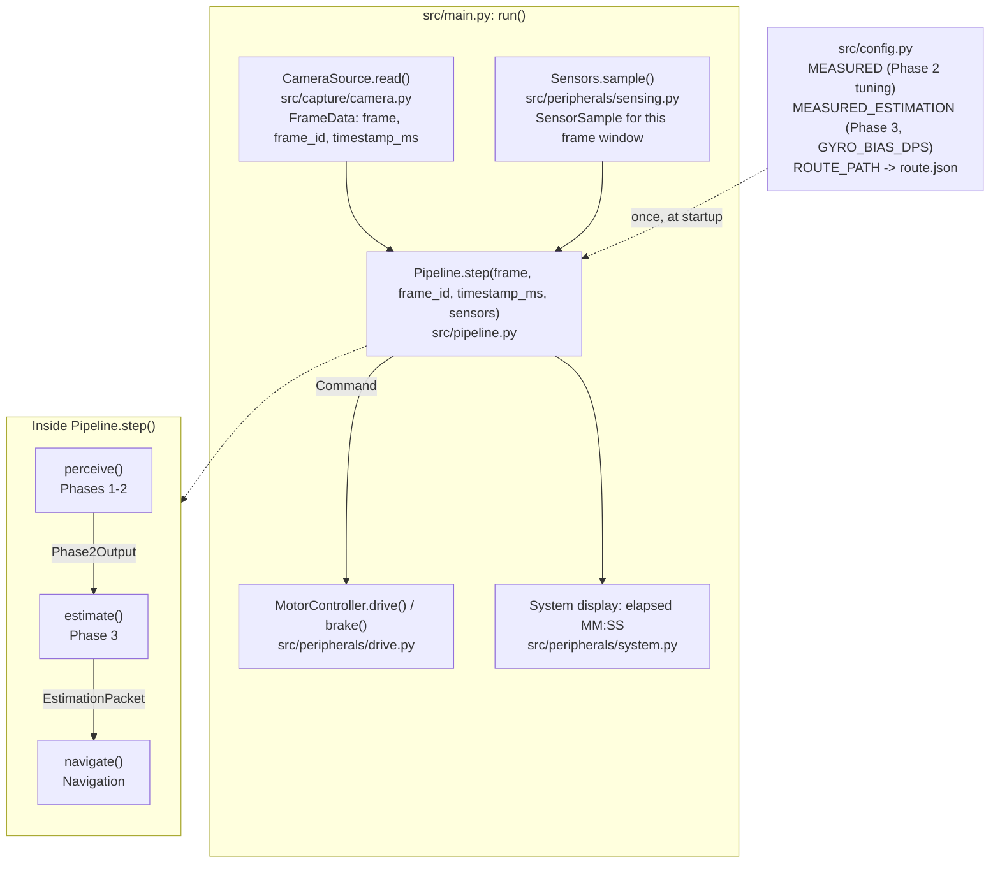
```mermaid
flowchart TB
    subgraph RUN["src/main.py: run()"]
        direction TB
        CAM["CameraSource.read()<br/>src/capture/camera.py<br/>FrameData: frame, frame_id, timestamp_ms"]
        SEN["Sensors.sample()<br/>src/peripherals/sensing.py<br/>SensorSample for this frame window"]
        STEP["Pipeline.step(frame, frame_id, timestamp_ms, sensors)<br/>src/pipeline.py"]
        MOT["MotorController.drive() / brake()<br/>src/peripherals/drive.py"]
        DISP["System display: elapsed MM:SS<br/>src/peripherals/system.py"]
        CAM --> STEP
        SEN --> STEP
        STEP -->|Command| MOT
        STEP --> DISP
    end

    subgraph STEPIN["Inside Pipeline.step()"]
        direction TB
        PER["perceive()<br/>Phases 1-2"]
        EST["estimate()<br/>Phase 3"]
        NAV["navigate()<br/>Navigation"]
        PER -->|Phase2Output| EST
        EST -->|EstimationPacket| NAV
    end
    STEP -.-> STEPIN

    CFG["src/config.py<br/>MEASURED (Phase 2 tuning)<br/>MEASURED_ESTIMATION (Phase 3, GYRO_BIAS_DPS)<br/>ROUTE_PATH -> route.json"]
    CFG -.->|once, at startup| STEP
```

The same flow with every stage function, in the order `Pipeline` calls them:

```mermaid
flowchart LR
    F["FrameData"] --> PP["preprocess_frame<br/>perception/preprocess.py"]
    PP --> RC["crop_rois<br/>perception/roi_crop.py"]
    RC --> GEO["detect_geometry<br/>perception/geometry.py"]
    GEO --> COL["detect_color<br/>perception/color_branch.py"]
    COL --> LO["estimate_lane_offset<br/>perception/lane_offset.py"]
    LO --> SLD["estimate_stop_line_distance<br/>perception/stop_line_distance.py"]
    SLD --> FU["fuse<br/>perception/feature_fusion.py"]
    FU --> PK["package_phase2<br/>perception/phase2_out.py"]
    PK -->|Phase2Output| P3["Phase3Processor.process<br/>estimation/estimation.py"]
    P3 -->|EstimationPacket| NV["Navigation.update<br/>navigation/navigation.py"]
    NV --> EN["enforce<br/>navigation/navigation_contract.py"]
    EN -->|Command| OUT["motors"]
```

**What each handoff carries:**

| Handoff | Type | Defined in | Key fields |
<<<<<<< HEAD
|---|---|---|---|
=======
| --- | --- | --- | --- |
>>>>>>> 1de5b8b (Add comprehensive documentation for system maps and pipeline architecture)
| Camera → Phase 2 | `FrameData` | `capture/camera.py` | BGR frame, `frame_id`, `timestamp_ms` (monotonic) |
| Phase 2 → Phase 3 | `Phase2Output` | `perception/phase2_out.py` | `detections`, `lane_offset_results`, `stop_line_results`, frame stamp |
| Sensors → Phase 3 | `SensorSample` | `estimation/estimation.py` | `yaw_rate_dps`, `lateral_accel_mps2`, `left/right_wheel_cps` |
| Phase 3 → Navigation | `EstimationPacket` | `estimation/estimation.py` | `lane_offset(_cm)`, `lane_status`, `heading_error`, `drive_state`, stop sign / line flags, `stop_line_distance_px/cm`, `yaw_rate`, wheel cps, `lane_mode` |
| Navigation → motors | `Command` | `navigation/navigation_contract.py` | `left`, `right` duty in [-1, 1], or `brake` |

Frame identity (`frame_id`, `timestamp_ms`) is minted once, in `CameraSource.read()`, and every later stage copies it, never re-derives it. That is how a `nav.csv` row, a `p3.csv` row and a video frame line up.

**Production vs instrumented.** Every Phase 2 stage has two versions side by side in its file: a production twin with no debug output (`detect_geometry`, `estimate_lane_offset`, `fuse`, …), which `Pipeline` uses, and a debug version (`run_geometry_stage`, `compute_lane_offset`, `fuse_detections`, …), which the linkers use. Tests hold the twins to identical results (section 8).

---

## 2. The linkers: order and what each proves

A linker runs a growing slice of the real chain with everything recorded, so that when something goes wrong you can see which stage did it. Each one builds on the one before, and the order is the order to trust them in: don't debug a turn until the packets are right, and don't debug packets until Phase 2 sees the lane.

```mermaid
flowchart LR
    L2["phase2_linker<br/>Phases 1-2<br/>run_chain()"]
    L3["phase3_linker<br/>Phases 1-3<br/>run_phase3_chain()"]
    LM["maneuver_linker<br/>drive trial<br/>maneuver.py"]
    LN["navigation_linker<br/>whole chain drives<br/>run()"]
    LI["intersection_linker<br/>one intersection per run<br/>run_sequence()"]
    MAIN["main.py<br/>course run<br/>nothing recorded"]

    L2 -->|"Phase 2 sees the lane,<br/>lines, signs, lights"| L3
    L3 -->|"packets are right<br/>with the sensors"| LM
    LM -->|"motors, IMU, encoders<br/>do what they're told"| LN
    LN -->|"Navigation drives<br/>the lane and stops"| LI
    LI -->|"straight, left, right<br/>each PASS"| MAIN
```

| Linker | Runs | Motors | What a good run proves | Output |
<<<<<<< HEAD
|---|---|---|---|---|
=======
| --- | --- | --- | --- | --- |
>>>>>>> 1de5b8b (Add comprehensive documentation for system maps and pipeline architecture)
| `phase2_linker` | Camera or replay → Phase 2 | No | The ROIs sit right; lane boundaries, stop lines, signs and lights are detected; the lane offset and stop-line distance make sense | Live view, per-stage overlays |
| `phase3_linker` | → Phase 3 (`TracedPhase3Processor`) | No | Smoothing, the dropout hold, the votes and the heading integrator behave over time; sensors arrive (`--imu`, `--encoders`) | `p3.csv`, `summary.txt`, Phase 3 video |
| `maneuver_linker` | Scripted drive (`maneuver.py`); vision only records | Yes | The gyro bias at rest, the IMU's yaw sign, straight legs on the encoders, a 180° turn on the gyro: the hardware the navigation relies on | `maneuver.csv`, `report.json`, `maneuver.avi` |
| `navigation_linker` | Whole chain + `Navigation` | Yes (`--camera`) | Lane keeping, stop lines, stop signs, red lights, intersections, the route and the end of the course, exactly as `main` drives | `nav.csv`, `p3.csv`, `nav.avi` |
| `intersection_linker` | `navigation_linker` with a one-step route | Yes (`--camera`) | Each maneuver (straight, left, right) crosses one intersection and gets the lane back: judged PASS or CHECK | Per-maneuver folders, `summary.txt`, `report.json` |
| `main` | `Pipeline.step()` | Yes | The course | The time on the display |

How they're built on each other. No linker copies another's stage order: each calls the one below it.

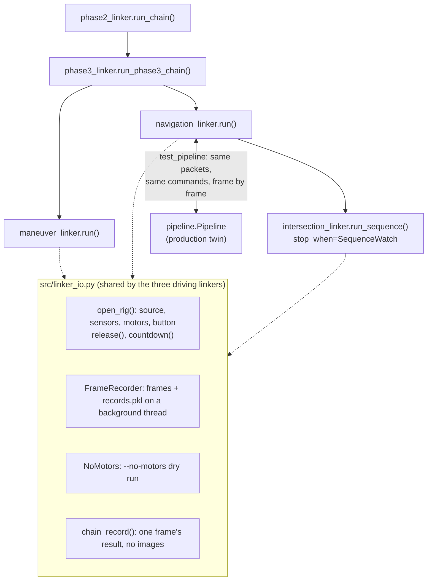
```mermaid
flowchart TB
    subgraph SHARED["src/linker_io.py (shared by the three driving linkers)"]
        RIG["open_rig(): source, sensors, motors, button<br/>release(), countdown()"]
        REC["FrameRecorder: frames + records.pkl on a background thread"]
        NOM["NoMotors: --no-motors dry run"]
        CR["chain_record(): one frame's result, no images"]
    end

    RCH["phase2_linker.run_chain()"] --> RP3["phase3_linker.run_phase3_chain()"]
    RP3 --> MLR["maneuver_linker.run()"]
    RP3 --> NLR["navigation_linker.run()"]
    NLR --> ILR["intersection_linker.run_sequence()<br/>stop_when=SequenceWatch"]

    MLR -.-> SHARED
    NLR -.-> SHARED
    ILR -.-> SHARED

    PIPE["pipeline.Pipeline<br/>(production twin)"]
    NLR <-->|"test_pipeline: same packets,<br/>same commands, frame by frame"| PIPE
```

---

## 3. Camera (Phase 1)

Phase 1 is `src/capture/camera.py`. It gets frames off the Pi camera with as little delay as possible and gives each one an identity.

### The capture pipeline

`build_gst_pipeline()` writes a GStreamer pipeline string that OpenCV opens with `cv2.CAP_GSTREAMER`:

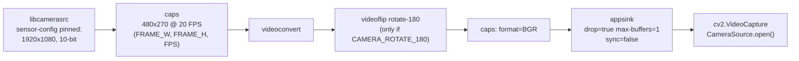
```mermaid
flowchart LR
    S["libcamerasrc<br/>sensor-config pinned:<br/>1920x1080, 10-bit"] --> C["caps<br/>480x270 @ 20 FPS<br/>(FRAME_W, FRAME_H, FPS)"]
    C --> V["videoconvert"]
    V --> FL["videoflip rotate-180<br/>(only if CAMERA_ROTATE_180)"]
    FL --> B["caps: format=BGR"]
    B --> A["appsink<br/>drop=true max-buffers=1<br/>sync=false"]
    A --> CV["cv2.VideoCapture<br/>CameraSource.open()"]
```

Why each piece is there:

- **Pinned sensor mode.** The sensor always reads the full 1920×1080 area and scales it down, so the field of view doesn't change with the output size. A different output size would otherwise crop the view and move every calibration.
- **480×270.** 16:9 like the sensor mode, and small enough for the Pi Zero to run Phases 2–3 at 20 FPS.
- **`appsink drop=true max-buffers=1`.** Only the newest frame is kept. If the loop runs slow, it gets the latest frame rather than one that's been waiting in a queue, so the robot always reacts to now.

### Reading a frame

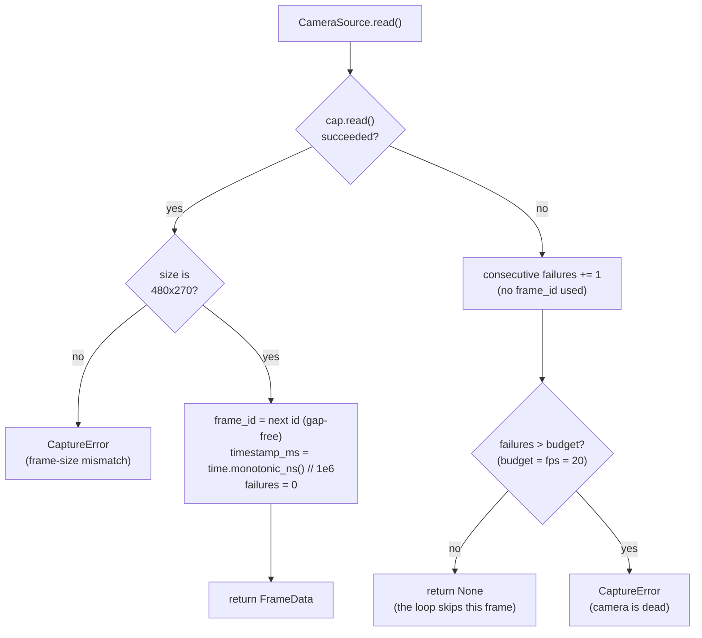
```mermaid
flowchart TB
    R["CameraSource.read()"] --> OK{"cap.read()<br/>succeeded?"}
    OK -->|yes| SZ{"size is<br/>480x270?"}
    SZ -->|no| ERR["CaptureError<br/>(frame-size mismatch)"]
    SZ -->|yes| ID["frame_id = next id (gap-free)<br/>timestamp_ms = time.monotonic_ns() // 1e6<br/>failures = 0"]
    ID --> FD["return FrameData"]
    OK -->|no| CNT["consecutive failures += 1<br/>(no frame_id used)"]
    CNT --> BUD{"failures > budget?<br/>(budget = fps = 20)"}
    BUD -->|no| NONE["return None<br/>(the loop skips this frame)"]
    BUD -->|yes| ERR2["CaptureError<br/>(camera is dead)"]
```

- **Monotonic time.** `timestamp_ms` comes from `time.monotonic`, which never jumps when the clock is set (NTP). The sensor hub stamps its readings on the same clock, so a frame and its sensor window line up.
- **Gap-free ids.** A failed read doesn't consume an id, and ids carry on across a reopen, so a gap in `frame_id` always means a frame dropped downstream, never in capture.
- **Failure budget.** One bad read is absorbed (`None`); a second of failures in a row (20 at 20 FPS) means the camera is gone and raises `CaptureError`, which ends the run with the motors stopped first.

Replays use the same interface: `live_view.VideoFrameSource` and `DirectoryFrameSource` produce `FrameData` from a video or a folder of PNGs, so everything downstream runs the same on a replay as on the camera.

---

## 4. Perception (Phase 2)

Phase 2 (`src/perception/`) answers *what is in this frame*, one frame at a time, with no memory. It ends in `Phase2Output`.

### The whole phase

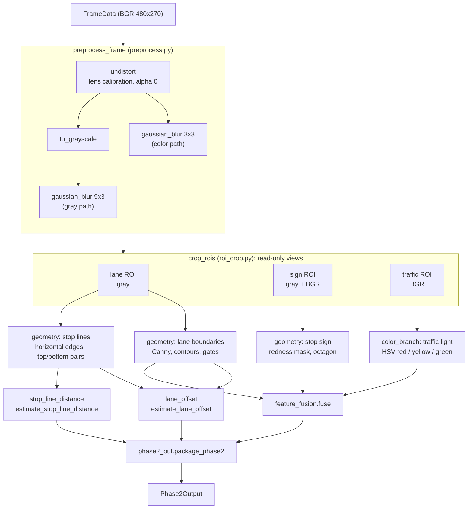
```mermaid
flowchart TB
    FD["FrameData (BGR 480x270)"] --> PRE

    subgraph PRE["preprocess_frame (preprocess.py)"]
        direction TB
        UD["undistort<br/>lens calibration, alpha 0"] --> GR["to_grayscale"]
        GR --> GB["gaussian_blur 9x3<br/>(gray path)"]
        UD --> CB["gaussian_blur 3x3<br/>(color path)"]
    end

    PRE --> ROI

    subgraph ROI["crop_rois (roi_crop.py): read-only views"]
        direction LR
        LR1["lane ROI<br/>gray"]
        SR1["sign ROI<br/>gray + BGR"]
        TR1["traffic ROI<br/>BGR"]
    end

    LR1 --> GEOL["geometry: lane boundaries<br/>Canny, contours, gates"]
    LR1 --> GEOS["geometry: stop lines<br/>horizontal edges, top/bottom pairs"]
    SR1 --> GEOG["geometry: stop sign<br/>redness mask, octagon"]
    TR1 --> COLR["color_branch: traffic light<br/>HSV red / yellow / green"]

    GEOL --> LOFF["lane_offset<br/>estimate_lane_offset"]
    GEOS --> LOFF
    GEOS --> SLD["stop_line_distance<br/>estimate_stop_line_distance"]
    GEOL --> FUS["feature_fusion.fuse"]
    GEOG --> FUS
    COLR --> FUS

    FUS --> PKG["phase2_out.package_phase2"]
    LOFF --> PKG
    SLD --> PKG
    PKG --> OUT["Phase2Output"]
```

Lane offset and stop-line distance read the geometry result directly, not fusion's output: fusion keeps only a centroid and a confidence, and the measurements need the full shapes.

### Where the ROIs sit

Fractions of the frame (`roi_crop.py`), in pixels at 480×270:

| ROI | From | x | y | Why there |
<<<<<<< HEAD
|---|---|---|---|---|
=======
| --- | --- | --- | --- | --- |
>>>>>>> 1de5b8b (Add comprehensive documentation for system maps and pipeline architecture)
| Lane | gray | 0.05–0.95 → 24–456 | 0.70–1.00 → 189–270 | The floor just ahead: lane lines and stop lines |
| Traffic | BGR | 0.25–0.65 → 120–312 | 0.00–0.40 → 0–108 | Top center, where a light sits when the robot is square to an intersection |
| Sign | gray + BGR | 0.55–1.00 → 264–480 | 0.20–0.75 → 54–202 | Upper right: signs are posted right of the lane |

Each ROI is a view into the frame, not a copy, and keeps its rectangle so detections can be mapped back to frame pixels.

### Preprocess: why two paths

- **Undistort first**, before the split, so every branch sees the same straightened geometry. The ground homography and the stop-line table are only valid for exactly this undistortion.
- **Gray path** (lane and sign shapes): edges come from brightness. The 9×3 blur is wider than it is tall, smoothing along the lane lines more than across them.
- **Color path** (traffic light, sign redness): HSV thresholds need the chroma that gray throws away, and a light 3×3 blur.

### Geometry branch (`geometry.py`)

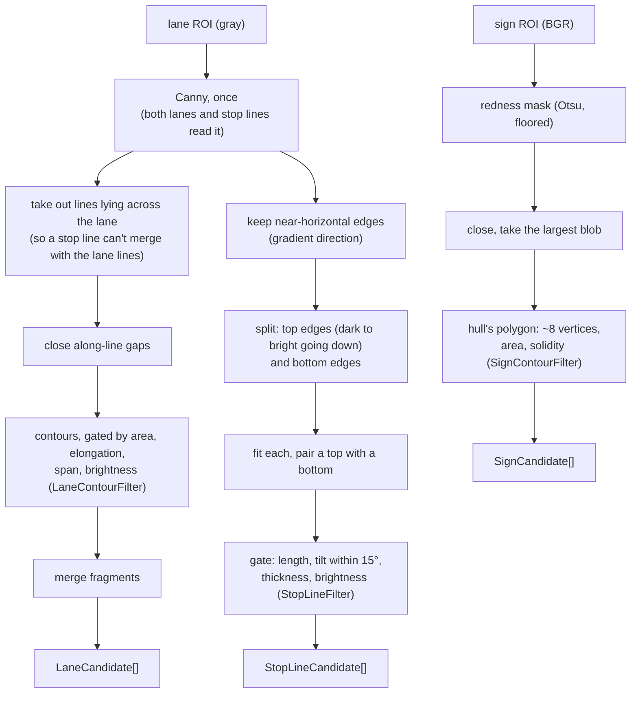
```mermaid
flowchart TB
    LR["lane ROI (gray)"] --> CAN["Canny, once<br/>(both lanes and stop lines read it)"]

    CAN --> L1["take out lines lying across the lane<br/>(so a stop line can't merge with the lane lines)"]
    L1 --> L2["close along-line gaps"]
    L2 --> L3["contours, gated by area, elongation,<br/>span, brightness (LaneContourFilter)"]
    L3 --> L4["merge fragments"]
    L4 --> LC["LaneCandidate[]"]

    CAN --> S1["keep near-horizontal edges<br/>(gradient direction)"]
    S1 --> S2["split: top edges (dark to bright going down)<br/>and bottom edges"]
    S2 --> S3["fit each, pair a top with a bottom"]
    S3 --> S4["gate: length, tilt within 15°,<br/>thickness, brightness (StopLineFilter)"]
    S4 --> SC["StopLineCandidate[]"]

    SG["sign ROI (BGR)"] --> G1["redness mask (Otsu, floored)"]
    G1 --> G2["close, take the largest blob"]
    G2 --> G3["hull's polygon: ~8 vertices,<br/>area, solidity (SignContourFilter)"]
    G3 --> GC["SignCandidate[]"]
```

The stop sign is found by color, not edges: a red sign on a floor of similar brightness gives Canny almost nothing in gray. Stop lines have their own config and never change what the lane detector sees.

### Lane offset (`lane_offset.py`)

The steering error: where the robot is relative to its own lane's center, in [-1, 1] of half the lane ROI's width (+ = robot right of center).

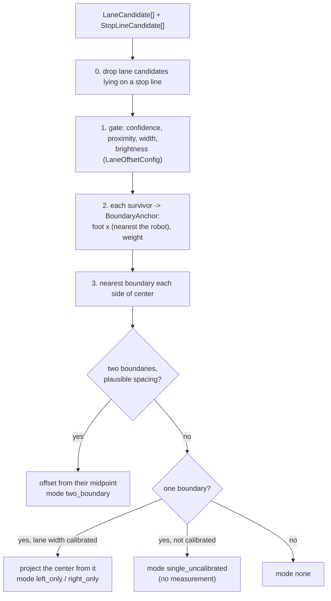
```mermaid
flowchart TB
    IN["LaneCandidate[] + StopLineCandidate[]"] --> Z["0. drop lane candidates lying on a stop line"]
    Z --> G["1. gate: confidence, proximity, width,<br/>brightness (LaneOffsetConfig)"]
    G --> A["2. each survivor -> BoundaryAnchor:<br/>foot x (nearest the robot), weight"]
    A --> N["3. nearest boundary each side of center"]
    N --> TWO{"two boundaries,<br/>plausible spacing?"}
    TWO -->|yes| M2["offset from their midpoint<br/>mode two_boundary"]
    TWO -->|no| ONE{"one boundary?"}
    ONE -->|"yes, lane width calibrated"| M1["project the center from it<br/>mode left_only / right_only"]
    ONE -->|"yes, not calibrated"| MU["mode single_uncalibrated<br/>(no measurement)"]
    ONE -->|no| MN["mode none"]
```

The *foot* of a boundary (where the marking is closest to the robot) is used rather than its center, because for an angled line the center isn't where the line meets the robot.

### Stop-line distance (`stop_line_distance.py`)

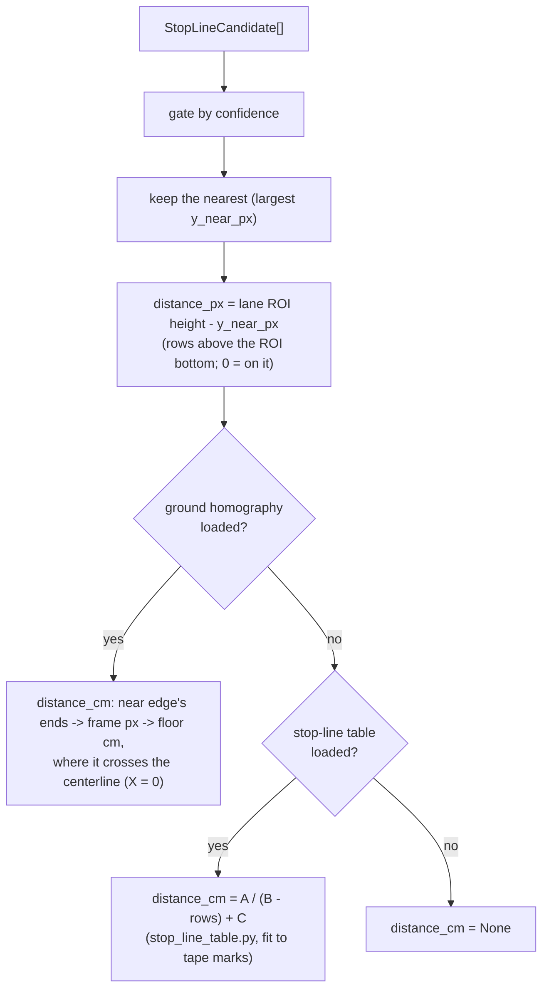
```mermaid
flowchart TB
    SC["StopLineCandidate[]"] --> G["gate by confidence"]
    G --> NR["keep the nearest (largest y_near_px)"]
    NR --> PX["distance_px = lane ROI height - y_near_px<br/>(rows above the ROI bottom; 0 = on it)"]
    PX --> H{"ground homography<br/>loaded?"}
    H -->|yes| CMH["distance_cm: near edge's ends -> frame px -> floor cm,<br/>where it crosses the centerline (X = 0)"]
    H -->|no| T{"stop-line table<br/>loaded?"}
    T -->|yes| CMT["distance_cm = A / (B - rows) + C<br/>(stop_line_table.py, fit to tape marks)"]
    T -->|no| NONE["distance_cm = None"]
```

The camera's view of the floor ends about 10 cm ahead of the robot, so a stop line leaves the view before the robot reaches it. Navigation's `StopLineTracker` handles that (section 6).

### Fusion and packaging

`feature_fusion.fuse()` turns the branches' candidates into one list of `DetectionObject`s: the best traffic light, every lane boundary by confidence, the best stop sign. `package_phase2()` adds the lane offset and stop-line results, checks that everything carries the same frame stamp, and hands Phase 3 one `Phase2Output`.

---

## 5. Estimation (Phase 3)

Phase 3 (`src/estimation/estimation.py`) answers *what is true across the last few frames, given the sensors*. A stage belongs here only if it uses history (smoothing, voting, holding) or sensor data. `Phase3Processor.process()` is the only place the order is written.

### The sensor path into Phase 3

The sensors run at 100 Hz, the camera at 20 FPS. `SensorHub` (`src/peripherals/sensing.py`) bridges them:

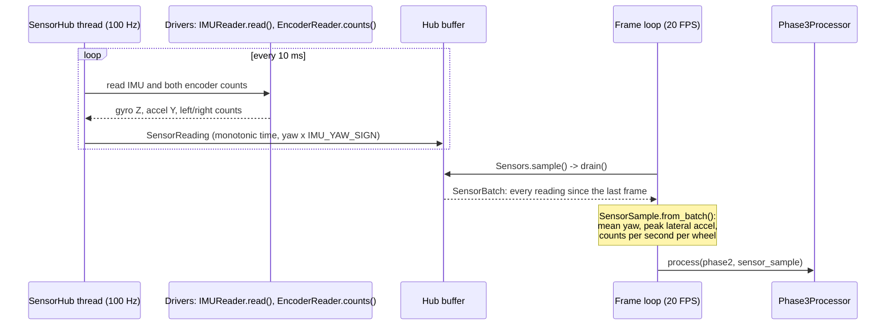
```mermaid
sequenceDiagram
    participant T as SensorHub thread (100 Hz)
    participant D as Drivers: IMUReader.read(), EncoderReader.counts()
    participant B as Hub buffer
    participant L as Frame loop (20 FPS)
    participant P as Phase3Processor

    loop every 10 ms
        T->>D: read IMU and both encoder counts
        D-->>T: gyro Z, accel Y, left/right counts
        T->>B: SensorReading (monotonic time, yaw x IMU_YAW_SIGN)
    end
    L->>B: Sensors.sample() -> drain()
    B-->>L: SensorBatch: every reading since the last frame
    Note over L: SensorSample.from_batch():<br/>mean yaw, peak lateral accel,<br/>counts per second per wheel
    L->>P: process(phase2, sensor_sample)
```

The yaw sign (`IMU_YAW_SIGN`, + = turning right) is applied once, in the hub, so nothing downstream knows how the IMU is mounted. The gyro bias is **not** removed in the hub: Phase 3 and the intersection rule each subtract `GYRO_BIAS_DPS` where they integrate.

### Inside `Phase3Processor.process()`

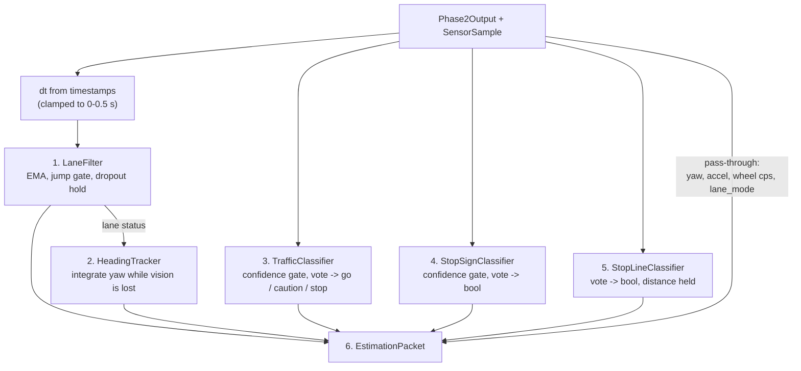
```mermaid
flowchart TB
    IN["Phase2Output + SensorSample"] --> DT["dt from timestamps<br/>(clamped to 0-0.5 s)"]
    DT --> LF["1. LaneFilter<br/>EMA, jump gate, dropout hold"]
    LF -->|"lane status"| HT["2. HeadingTracker<br/>integrate yaw while vision is lost"]
    IN --> TC["3. TrafficClassifier<br/>confidence gate, vote -> go / caution / stop"]
    IN --> SS["4. StopSignClassifier<br/>confidence gate, vote -> bool"]
    IN --> SL["5. StopLineClassifier<br/>vote -> bool, distance held"]
    LF --> PK["6. EstimationPacket"]
    HT --> PK
    TC --> PK
    SS --> PK
    SL --> PK
    IN -->|"pass-through:<br/>yaw, accel, wheel cps, lane_mode"| PK
```

Each stage is its own small class that owns only its own state, so it can be tested alone and can't reach into another.

### LaneFilter: vision, hold, stale

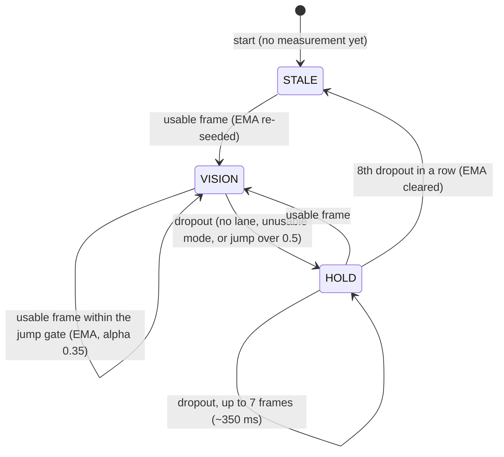
```mermaid
stateDiagram-v2
    [*] --> STALE: start (no measurement yet)
    STALE --> VISION: usable frame (EMA re-seeded)
    VISION --> VISION: usable frame within the jump gate (EMA, alpha 0.35)
    VISION --> HOLD: dropout (no lane, unusable mode, or jump over 0.5)
    HOLD --> VISION: usable frame
    HOLD --> HOLD: dropout, up to 7 frames (~350 ms)
    HOLD --> STALE: 8th dropout in a row (EMA cleared)
```

- **Usable** means mode `two_boundary`, `left_only` or `right_only`.
- **Jump gate.** A change of more than 0.5 (normalized) in one frame isn't believable, so it's treated as a dropout.
- **Hold** repeats the last good offset. **Stale** means the offset is old. Clearing the EMA there lets the next good frame re-seed it instead of being rejected by the jump gate forever.

### HeadingTracker

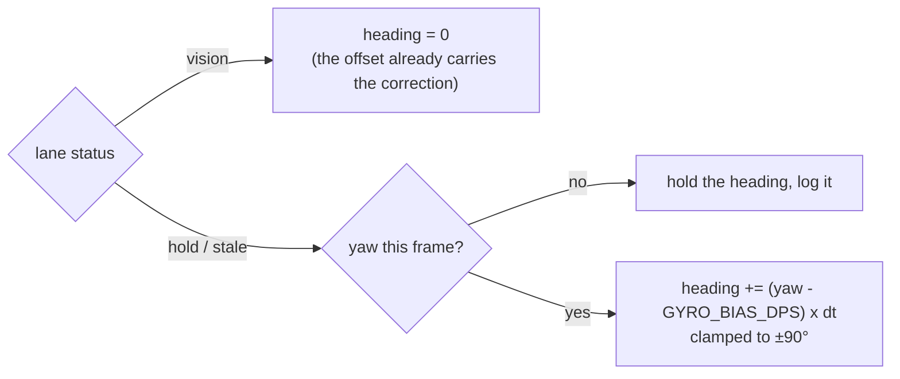
```mermaid
flowchart LR
    S{"lane status"} -->|vision| Z["heading = 0<br/>(the offset already carries the correction)"]
    S -->|"hold / stale"| Y{"yaw this frame?"}
    Y -->|no| H["hold the heading, log it"]
    Y -->|yes| I["heading += (yaw - GYRO_BIAS_DPS) x dt<br/>clamped to ±90°"]
```

`heading_error` is how far the robot has turned since it last saw the lane, so lane keeping can steer by the gyro through a gap in the lines.

### The votes

Traffic light, stop sign and stop line each keep a majority vote over the last 3 frames (`vote_window`), so one noisy frame can't flip a decision. The traffic light and stop sign first drop detections below their confidence gates (0.40 and 0.45). The stop line's distance is held through a frame that misses the line while the vote still stands.

---

## 6. Navigation

Navigation (`src/navigation/`) turns each `EstimationPacket` into a `Command`. Each decision lives in its own file as a **rule** with one job; `navigation.py` is the one place that says in which order they're asked.

### One frame in `Navigation.update()`

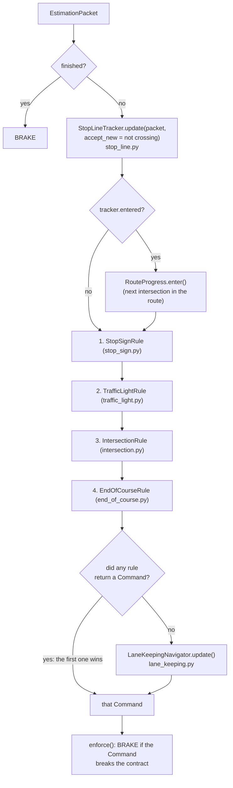
```mermaid
flowchart TB
    P["EstimationPacket"] --> FIN{"finished?"}
    FIN -->|yes| BR0["BRAKE"]
    FIN -->|no| TR["StopLineTracker.update(packet,<br/>accept_new = not crossing)<br/>stop_line.py"]
    TR --> EN{"tracker.entered?"}
    EN -->|yes| RP["RouteProgress.enter()<br/>(next intersection in the route)"]
    EN -->|no| R1
    RP --> R1

    R1["1. StopSignRule (stop_sign.py)"] --> R2["2. TrafficLightRule (traffic_light.py)"]
    R2 --> R3["3. IntersectionRule (intersection.py)"]
    R3 --> R4["4. EndOfCourseRule (end_of_course.py)"]
    R4 --> ANY{"did any rule<br/>return a Command?"}
    ANY -->|"yes: the first one wins"| CMD["that Command"]
    ANY -->|no| LK["LaneKeepingNavigator.update()<br/>lane_keeping.py"]
    LK --> CMD
    CMD --> EF["enforce(): BRAKE if the Command<br/>breaks the contract"]
```

**Every rule sees every frame**, even after a higher rule has decided (`held=True`), so each one keeps its own timers and state current. A held frame tells a rule "you weren't heard": the intersection rule doesn't run its turn timer while a stop sign holds the robot, and the end-of-course count pauses.

### The stop-line tracker: the shared clock of every intersection

The camera loses sight of a stop line about 10 cm before the robot reaches it, so "the line is gone" doesn't mean "the robot is at the line".

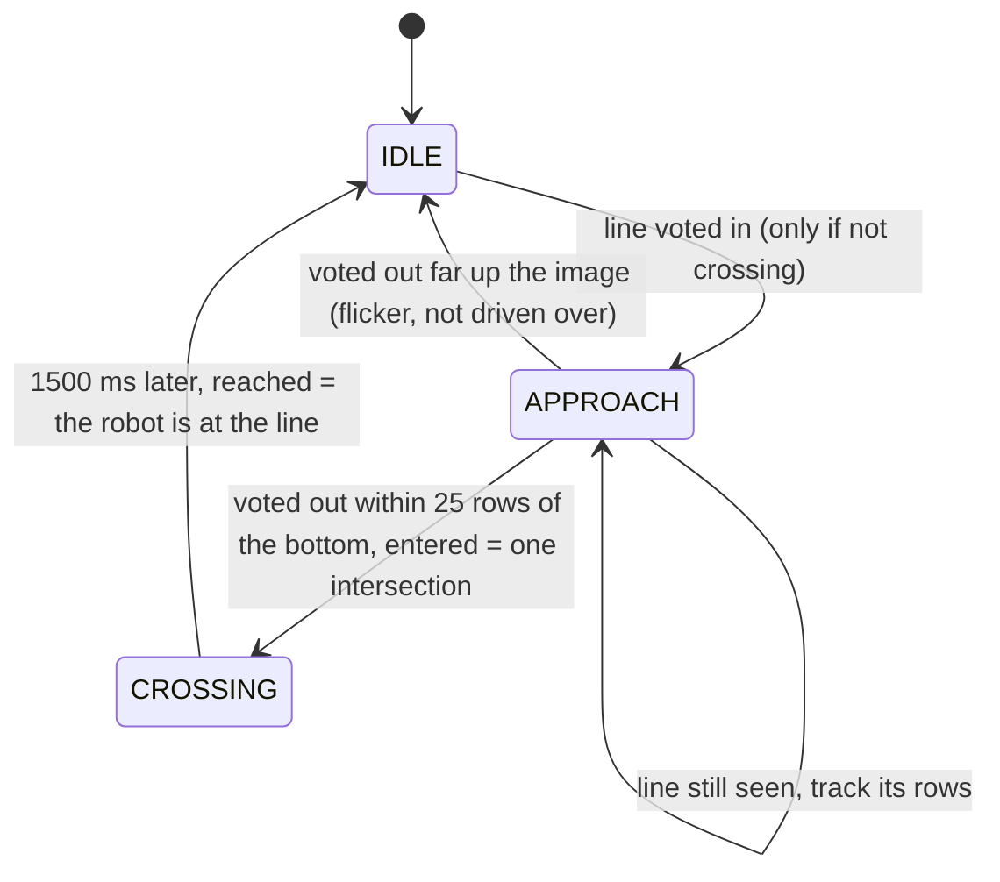
```mermaid
stateDiagram-v2
    [*] --> IDLE
    IDLE --> APPROACH: line voted in (only if not crossing)
    APPROACH --> APPROACH: line still seen, track its rows
    APPROACH --> CROSSING: voted out within 25 rows of the bottom, entered = one intersection
    APPROACH --> IDLE: voted out far up the image (flicker, not driven over)
    CROSSING --> IDLE: 1500 ms later, reached = the robot is at the line
```

The stop sign, traffic light and intersection rules all read this one tracker: `entered` (the line passed under the view) and `reached` (one frame, `STOP_DELAY_MS` later).

### The rules

| Rule | Speaks when | Says |
<<<<<<< HEAD
|---|---|---|
=======
| --- | --- | --- |
>>>>>>> 1de5b8b (Add comprehensive documentation for system maps and pipeline architecture)
| `StopSignRule` | At `reached`, if a stop sign was seen in the last 5 s | BRAKE until the wheels read stopped (< 20 cps), hold 2 s, release |
| `TrafficLightRule` | At `reached`, if the voted state is `stop` (red) | BRAKE until the light isn't red. Green and yellow drive on |
| `IntersectionRule` | From `CROSSING` until the lane is back | Heading hold, the route's turn, then heading hold (below) |
| `EndOfCourseRule` | Lane `stale` (not held), or the finish line | Creep at 0.30 duty steering by heading; still stale after 1 s → BRAKE, finished. Finish line reached → BRAKE, finished |
| `LaneKeepingNavigator` | Nobody else spoke | Base 0.40 duty; steer by `lane_offset_cm` on vision (gain grows with the offset), by `heading_error` on hold/stale; ±0.40 max |

### IntersectionRule's three stages

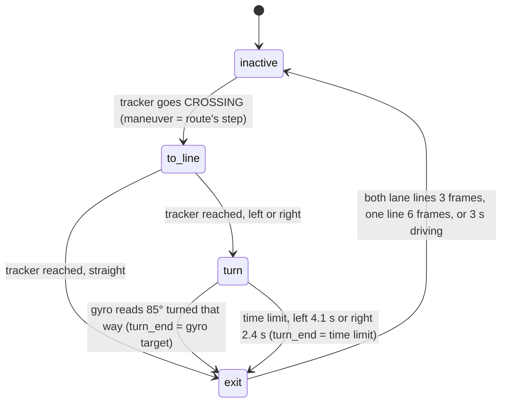
```mermaid
stateDiagram-v2
    [*] --> inactive
    inactive --> to_line: tracker goes CROSSING (maneuver = route's step)
    to_line --> turn: tracker reached, left or right
    to_line --> exit: tracker reached, straight
    turn --> exit: gyro reads 85° turned that way (turn_end = gyro target)
    turn --> exit: time limit, left 4.1 s or right 2.4 s (turn_end = time limit)
    exit --> inactive: both lane lines 3 frames, one line 6 frames, or 3 s driving
```

| Stage | Command | Ends |
<<<<<<< HEAD
|---|---|---|
=======
| --- | --- | --- |
>>>>>>> 1de5b8b (Add comprehensive documentation for system maps and pipeline architecture)
| `to_line` | Base duty, steering only against the heading turned (gyro) | At the line, 1.5 s after it left the view |
| `turn` | Left `(0.36, 0.63)`, a wide arc; right `(0.45, 0.0)`, a pivot on the right wheel | 85° on the gyro, or the time limit |
| `exit` | Heading hold on the heading the turn ended on | The lane is back; lane keeping takes over |

While it's active, the tracker takes up no new stop line, so marks inside the intersection can't restart the crossing or count as another intersection.

### How a run ends

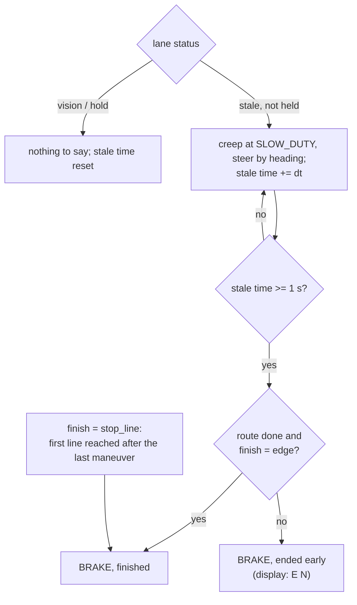
```mermaid
flowchart TB
    S{"lane status"} -->|"vision / hold"| OK["nothing to say; stale time reset"]
    S -->|"stale, not held"| C["creep at SLOW_DUTY, steer by heading;<br/>stale time += dt"]
    C --> T{"stale time >= 1 s?"}
    T -->|no| C
    T -->|yes| D{"route done and<br/>finish = edge?"}
    D -->|yes| F["BRAKE, finished"]
    D -->|no| E["BRAKE, ended early<br/>(display: E N)"]
    FL["finish = stop_line:<br/>first line reached after the last maneuver"] --> F
```

---

## 7. Why the turns moved into `intersection.py`

### What `turning_sequences.py` was

Ignacio's file held the turns measured on the mat: a left at `(0.36, 0.63)` for 2.75 s and a right at `(0.45, 0.0)` for 1.62 s. Those duties and times are the real data behind the turns, and they're still in the code: the duties are `LEFT_TURN` / `RIGHT_TURN`, and the times (plus half) are the turns' time limits.

It was built as a `CustomSequenceNavigator` *wrapped around* `Navigation`:

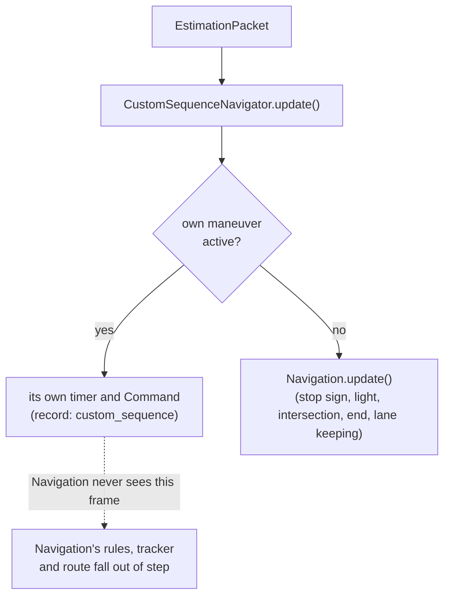
```mermaid
flowchart TB
    P["EstimationPacket"] --> CSN["CustomSequenceNavigator.update()"]
    CSN --> Q{"own maneuver<br/>active?"}
    Q -->|yes| OWN["its own timer and Command<br/>(record: custom_sequence)"]
    Q -->|no| NAV["Navigation.update()<br/>(stop sign, light, intersection, end, lane keeping)"]
    OWN -.->|"Navigation never sees this frame"| X["Navigation's rules, tracker<br/>and route fall out of step"]
```

Wrapping a second decision-maker around the first raised problems that weren't about the turns themselves:

| Problem | Why it mattered |
<<<<<<< HEAD
|---|---|
=======
| --- | --- |
>>>>>>> 1de5b8b (Add comprehensive documentation for system maps and pipeline architecture)
| Two controllers deciding the same frames | While the sequence drove, `Navigation` wasn't called, so its stop-line tracker, stop-sign timers and route didn't advance with the robot |
| It started on any stop line seen | It checked `stop_line_detected`, so it fired when a line came into view, not when the robot reached it |
| It read packet fields that don't exist | `pkt.stop_line_tracker` and `pkt.reached_line` aren't in `EstimationPacket`; the defaults made "at the line" true immediately |
| The maneuver never came from the route | `update()` called the sequence without a maneuver, so it always ran its default, straight |
| Turns by time only | A timed turn's angle changes with the battery and the floor; nothing checked that it had actually turned 90° |
| Not in the record | `nav.csv` showed `custom_sequence` with no stage or heading, so a bad turn couldn't be diagnosed from the run |

### What `IntersectionRule` does instead

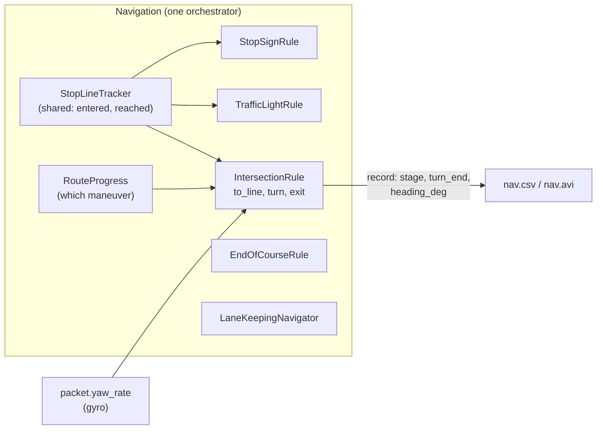
```mermaid
flowchart LR
    subgraph NAVB["Navigation (one orchestrator)"]
        T["StopLineTracker<br/>(shared: entered, reached)"]
        RP["RouteProgress<br/>(which maneuver)"]
        SS["StopSignRule"]
        TL["TrafficLightRule"]
        IR["IntersectionRule<br/>to_line, turn, exit"]
        EOC["EndOfCourseRule"]
        LK["LaneKeepingNavigator"]
    end
    T --> SS
    T --> TL
    T --> IR
    RP --> IR
    GY["packet.yaw_rate<br/>(gyro)"] --> IR
    IR -->|"record: stage, turn_end,<br/>heading_deg"| CSV["nav.csv / nav.avi"]
```

- **The same tracker.** The turn starts at `reached`, the same moment a stop sign would stop the robot, so "stop, then turn" works without the two rules knowing about each other.
- **The route decides the maneuver.** `RouteProgress` advances once per intersection, and the rule reads that step's maneuver.
- **The gyro ends the turn** at 85°, with Ignacio's times kept as the backstop if the gyro never gets there. `turn_end` in the record says which one ended it.
- **Held frames pause it**, so a stop sign at a turning intersection holds the robot first and the turn starts after.
- **Everything is recorded**: stage, heading, how the turn ended. `intersection_linker` judges each maneuver from that record.

### How it fits the bigger organization

The Pi's code is layered. Each layer only calls down, and each layer's decisions live in one file:

```mermaid
flowchart TB
    subgraph LOOPS["Run loops (own the hardware, own the time)"]
        MAIN["main.py"]
        LNK["*_linker.py"]
    end
    subgraph FLOW["Flow (declares the order, no logic)"]
        PIPE["pipeline.py"]
        NAVO["navigation/navigation.py"]
    end
    subgraph LOGIC["Logic (pure: no hardware, runs and tests anywhere)"]
        PERC["perception/*"]
        EST["estimation/estimation.py"]
        RULES["navigation/* rules<br/>stop_line, stop_sign, traffic_light,<br/>intersection, end_of_course, lane_keeping"]
        MAN["maneuver.py"]
    end
    subgraph HW["Drivers (the only code that touches the Pi's hardware)"]
        CAMH["capture/camera.py"]
        SENS["peripherals/sensing.py<br/>imu.py, drive.py, system.py"]
    end
    CFG["config.py / params.py<br/>(tuning and facts, no code)"]

    LOOPS --> FLOW
    FLOW --> LOGIC
    LOOPS --> HW
    CFG -.-> LOOPS
    CFG -.-> FLOW
```

The rules this follows, and what each one buys:

| Rule | What it buys |
<<<<<<< HEAD
|---|---|
=======
| --- | --- |
>>>>>>> 1de5b8b (Add comprehensive documentation for system maps and pipeline architecture)
| One file per decision | A stop-sign bug is in `stop_sign.py`; a turn bug in `intersection.py` |
| One place for the order (`navigation.py`, `pipeline.py`, `Phase3Processor.process`) | Priority is readable in one screen, and can't drift between copies |
| Logic never imports hardware | Rules run on a laptop and in CI; `test_navigation_contract` fails if one imports `pigpio` |
| Time comes from packet timestamps | A replay of a video makes the same decisions as the live run |
| A production twin and an instrumented twin, held equal by tests | `main` pays for no debug output, and the linkers still show exactly what `main` would do |

`turning_sequences.py` was a second orchestrator sitting above `Navigation`. Moving the turns into a rule made them one more decision in the one order, sharing the tracker, the route and the record with everything else.

---

## 8. The test harness

pytest runs from `vision_stack/`. Configuration is `pytest.ini` (paths) and `src/tests/conftest.py` (modes, fixtures).

### Two modes

```mermaid
flowchart TB
    CMD["pytest [options]"] --> MODE{"--software / --hardware?"}
    MODE -->|"neither (default)"| SW["software mode"]
    MODE -->|"--software"| SW
    MODE -->|"--hardware"| HWM["hardware mode"]
    SW --> SEL["conftest: pytest_collection_modifyitems<br/>keeps tests marked for the mode,<br/>deselects the rest (not skipped)"]
    HWM --> SEL
    SEL --> SWT["@pytest.mark.software<br/>contract tests: fakes, synthetic frames,<br/>deterministic pass / fail"]
    SEL --> HWT["@pytest.mark.hardware<br/>characterization on the Pi:<br/>camera, IMU, motors; writes artifacts"]
```

Every test carries exactly one of the two marks. Software tests are the ones you run after every change (`pytest`, about 1,980 tests, about 80 s). Hardware tests measure the real robot and write files to study.

### Software tests: how they replace the hardware

```mermaid
flowchart LR
    subgraph FAKES["Test doubles (src/tests/)"]
        SC["scenes.py<br/>synthetic frames: lanes, stop lines,<br/>signs, lamps, noise; SCENE_CONFIG"]
        SIM["sim_robot.py<br/>SimRobot + FakeClock:<br/>wheels, body turn, IMU sign and bias"]
        NC["navigation_checks.py<br/>packets for the contract checks"]
        FK["per-test fakes:<br/>Camera, Sensors, Motor, pigpio module"]
    end
    subgraph KINDS["Kinds of software test"]
        U["Unit: one module each<br/>(test_geometry, test_estimation, ...)"]
        PAR["Parity: production twin == debug twin<br/>(test_production_parity, test_pipeline)"]
        E2E["Linker end to end on fakes<br/>(test_navigation_linker, test_intersection_linker, ...)"]
        CON["Contract: types, signs, no hardware imports<br/>(test_navigation_contract, test_config)"]
    end
    FAKES --> KINDS
```

- **Known answers from synthetic scenes.** A lane drawn at a known x must give the offset that x means. Synthetic frames are drawn already undistorted, so they run under `SCENE_CONFIG` (no undistortion), not `MEASURED`.
- **Parity.** `test_production_parity` runs each Phase 2 production twin against its debug twin on every scene. `test_pipeline` drives `Pipeline` and `navigation_linker` over the same synthetic course (`course_sequence()`, which moves every rule and turns left on the gyro) and requires the same packets and the same motor commands, frame by frame.
- **A simulated robot.** `sim_robot.SimRobot` turns duties into wheel counts and a body turn, and reports it through a fake IMU with a chosen sign and bias, so `maneuver_linker`'s checks have something real to find. `FakeClock` means nothing sleeps.
- **Fakes for hardware.** Tests swap in fake cameras, sensors and motors (and a fake `pigpio` module), so the command lines are tested down to "exit 2 if the camera won't open".
- **Mutation checks.** Each change in this repo was checked by deliberately breaking the new code and confirming a test fails.

### Hardware tests: the ladder and the artifacts

```mermaid
flowchart TB
    HT["a @pytest.mark.hardware test"] --> P1{"host can reach it?<br/>(pigpio daemon, I2C bus)"}
    P1 -->|no| SK1["skip: 'unavailable'"]
    P1 -->|yes| P2{"device answers a probe?<br/>(presence.py)"}
    P2 -->|no| SK2["skip: 'not found'"]
    P2 -->|yes| RUN["run: from here a failure is a fault,<br/>never a missing part"]
    RUN --> FR{"frames fixture"}
    FR -->|default| LIVE["live camera"]
    FR -->|"--replay=DIR"| REP["recorded PNGs"]
    RUN --> ART["artifacts/<timestamp>/<br/>run_meta.json (commit, dirty), CSV, PNG"]
    ART --> AN["python3 -m src.analysis.*<br/>stage_timing, jitter, stability, ..."]
```

- **`frames` fixture.** Hardware tests ask for frames without caring where they come from: the live camera by default, or a recorded folder with `--replay`, so the same test runs on the Pi or a desktop.
- **`--record`** saves the capture test's frames to `src/tests/data/frames`, the dataset some software tests use (they skip until it exists).
- **Artifacts** are written after each test's frame loop, never inside it, so file writes don't disturb the timing being measured.

### Test tiers (`testing_procedure.md`)

| Tier | When | Command |
<<<<<<< HEAD
|---|---|---|
=======
| --- | --- | --- |
>>>>>>> 1de5b8b (Add comprehensive documentation for system maps and pipeline architecture)
| 0. Software | After every code change | `pytest` (on the Pi: `--ignore=src/tests/test_calibration.py`) |
| 1. Health | Start of every Pi session | `pytest --hardware src/tests/test_system_monitor.py src/tests/test_capture.py` |
| 2. Characterization | After changing tuning or a stage | `pytest --hardware --replay=src/tests/data/frames`, then the analysis tools |
| 3. Scenarios | When tuning settles | `phase3_linker` runs: still scene, measured offsets |
| 4. Soak | Before the demo | `pytest --hardware --soak-minutes=15 src/tests/test_soak.py` |

Where to look next: `tests.md` lists what every test file covers, `pytest.md` has the commands, `analysis.md` explains the analysis tools.
